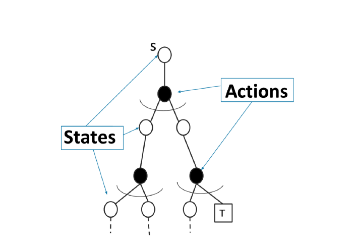

<p align="center">
  
</p>

# Stanford CS234: Reinforcement Learning

<p align="center">
  <a href="README.md"></a>
  
</p>

这是 Stanford CS234 强化学习公开课的个人学习档案，记录课程讲义、中文学习笔记、作业实现、实验结果与阶段性复盘。仓库按 lecture 和 assignment 组织，适合从课程材料出发逐步学习，也方便回看公式、算法和代码之间的对应关系。

**[课程索引](#课程索引)** · **[学习笔记](#学习笔记与概念索引)** · **[作业与代码](#作业与代码)** · **[当前进度](#当前进度)** · **[课程材料](#课程材料)**

## 课程索引

讲义笔记按课程顺序保存。表中的“覆盖”表示已经完成材料整理，不等同于能够独立推导、实现或迁移应用；掌握证据单独记录在 [学习状态](notes/learning_state.md) 中。

| Lecture | 主题 | 讲义 | 笔记 |
| :--- | :--- | :--- | :--- |
| 01 | Introduction to RL | [Slides](lecture/lec1/lecture1post.pdf) | [笔记](notes/lec_notes/lec1_notes.md) |
| 02 | Tabular MDP Planning | [Slides](lecture/lec2/lecture2post.pdf) | [笔记](notes/lec_notes/lec2_notes.md) |
| 03 | Model-Free Policy Evaluation | [Slides](lecture/lec3/lecture3post.pdf) | [笔记](notes/lec_notes/lec3_notes.md) |
| 04 | Model-Free Control and Function Approximation | [Slides](lecture/lecture4post.pdf) | [笔记](notes/lec_notes/lec4_notes.md) |
| 05 | Policy Gradient I | [Slides](lecture/lecture5post.pdf) | [笔记](notes/lec_notes/lec5_notes.md) |
| 06 | Policy Gradient II | [Slides](lecture/lecture6post.pdf) | [笔记](notes/lec_notes/lec6_notes.md) |
| 07 | Policy Gradients and Imitation Learning | [Slides](lecture/lecture7post.pdf) | [笔记](notes/lec_notes/lec7_notes.md) |
| 08 | Imitation Learning, Human Input, and Batch RL | [Slides](lecture/lecture8post.pdf) | [笔记](notes/lec_notes/lec8_notes.md) |
| 09 | Data-Efficient Reinforcement Learning | [Slides](lecture/lecture9post.pdf) | [笔记](notes/lec_notes/lec9_notes.md) |
| 10 | Fast Reinforcement Learning | [Slides](lecture/lecture10post.pdf) | [笔记](notes/lec_notes/lec10_notes.md) |
| 11 | Fast Reinforcement Learning | [Slides](lecture/lecture11post.pdf) | [笔记](notes/lec_notes/lec11_notes.md) |
| 12 | Fast RL Continued | [Slides](lecture/lecture12post.pdf) | [笔记](notes/lec_notes/lec12_notes.md) |
| 13 | Monte Carlo Tree Search | [Slides](lecture/lecture13post.pdf) | [笔记](notes/lec_notes/lec13_notes.md) |
| 14 | Monte Carlo Tree Search | [Slides](lecture/lecture14post.pdf) | [笔记](notes/lec_notes/lec14_notes.md) |

<details>
<summary><strong>展开 Lecture 1–14 的 pre-class 课件</strong></summary>

课前版 slides 与课后版分开保留，便于比较课堂前后的内容。Lecture 10 官网没有 pre-class 版本；Lecture 11 的课件封面虽误写为 Lecture 13，但文件内容明确标注为 Lecture 11。

- Lecture 1–3：[lec1](lecture/lec1/lecture1pre.pdf) · [lec2](lecture/lec2/lecture2pre.pdf) · [lec3](lecture/lec3/lecture3pre.pdf)
- Lecture 4–6：[lec4](lecture/lecture4pre.pdf) · [lec5](lecture/lecture5pre.pdf) · [lec6](lecture/lecture6pre.pdf)
- Lecture 7–9：[lec7](lecture/lecture7pre.pdf) · [lec8](lecture/lecture8pre.pdf) · [lec9](lecture/lecture9pre.pdf)
- Lecture 11–14：[lec11](lecture/lecture11pre.pdf) · [lec12](lecture/lecture12pre.pdf) · [lec13](lecture/lecture13pre.pdf) · [lec14](lecture/lecture14pre.pdf)

</details>

## 学习笔记与概念索引

笔记以课程材料为主线，补充公式推导、数值例子、代码映射和复习问题。完整的学习规范放在 `notes/learning_protocol.md`，不把公开课笔记强行改造成教材章节笔记。

| 入口 | 用途 |
| :--- | :--- |
| [学习状态](notes/learning_state.md) | 记录 lecture coverage、mastery evidence、assignment readiness 与下一步 |
| [概念索引](notes/concept_index.md) | 按概念回查首次完整讲解的位置 |
| [混淆记录](notes/confusions.md) | 记录真实存在且需要持续跟踪的概念或符号问题 |
| [学习协议](notes/learning_protocol.md) | 学习节奏、公式规范、来源忠实度与自测约定 |
| [课程环境说明](notes/cs234_environment.md) | 本地材料、工具和学习环境的说明 |

## 作业与代码

作业目录保留题目、模板、starter code，以及在本地完成练习时产生的实现和实验记录。代码仍按课程作业原结构组织，方便对照题面和运行说明。

| 作业 | 内容 | 入口 |
| :--- | :--- | :--- |
| Assignment 1 | Value Iteration、Policy Iteration、RiverSwim 等基础 MDP 实现 | [assignment1](assignment/assignment1/) |
| Assignment 2 | REINFORCE、value baseline、PPO 与 policy-induced distribution | [ass2](assignment/ass2/) · [starter README](assignment/ass2/assignment2_starter_code/README.md) · [实验结果](assignment/ass2/assignment2_starter_code/code/results/) |
| Assignment 3 | Preference learning、DPO、RLHF 与 Hopper 实验 | [ass3](assignment/ass3/) · [starter README](assignment/ass3/assignment3_starter_code/README.md) |
| 作业复习 | 按题目整理的前置知识、检查项与复习路线 | [Assignments Review Guide](assignment/ASSIGNMENTS_REVIEW_GUIDE.md) |

## 当前进度

截至最近一次学习记录：

- **Lecture coverage：** Lecture 1–14 已完成材料覆盖，相关讲义和笔记均已建立。
- **Mastery evidence：** 正在单独积累；覆盖完成不代表已经能够独立推导、实现或完成实验。
- **Assignment 2：** 已完成本地 policy-gradient、baseline、PPO 实现；`assignment/` 中保留题目、模板、starter code、实现代码，以及 seed-1 的 no-baseline、baseline、PPO CartPole 日志、分数数组和曲线。多 seed 与正式提交检查仍待补充。
- **下一检查点：** 回顾 Lectures 13–14，并准备课程安排中的 quiz；Assignment 3 的环境实验和伦理阅读仍按 [学习状态](notes/learning_state.md) 继续。
- **恢复学习：** 先看 [学习状态](notes/learning_state.md) 的末尾，再进入对应 lecture note 或 assignment。

## 课程材料

本地材料索引 [COURSE_MATERIALS_WINTER_2026.md](COURSE_MATERIALS_WINTER_2026.md) 记录了官网公开材料与本地文件的对应关系、版本差异和完整性检查。

| 资源 | 用途 |
| :--- | :--- |
| [Stanford CS234 course page](https://web.stanford.edu/class/cs234/index.html) | 课程主页与官方说明 |
| [Lecture Materials](https://web.stanford.edu/class/cs234/modules.html) | 讲义目录 |
| [Assignments](https://web.stanford.edu/class/cs234/assignments.html) | 作业题目与课程要求 |
| [Sutton & Barto](lecture/references/RLbook2018.pdf) | 课程参考教材 |
| [Bandit Algorithms](lecture/references/Bandit-Algorithms.pdf) | 课程指定 bandit 参考书，重点阅读 §7.1 |
| [World Models 专题讲座](lecture/ShaneGuCS234_2026.pdf) | Shane Gu 的 World Models 讲座材料 |
| [Value Alignment 专题讲座](lecture/ethics_society_234_2.pdf) | Value Alignment Part II |

讲义、作业题目和参考 PDF 以课程公开页面为来源；需要 Stanford 登录的 Canvas 视频、quiz 和成绩页面不在本地材料中伪造或替代。

<details>
<summary><strong>仓库结构</strong></summary>

```text
cs234/
├── README.md                           # 英文首页（默认）
├── README_ZH.md                        # 中文入口与学习地图
├── lecture/                            # 讲义、参考书与 guest materials
├── notes/
│   ├── lec_notes/                      # Lecture 1–14 学习笔记
│   ├── learning_state.md               # 唯一实时学习断点
│   ├── concept_index.md                # 概念首次完整讲解索引
│   ├── confusions.md                   # 持续跟踪的混淆点
│   └── learning_protocol.md            # 学习与笔记约定
├── assignment/                         # 作业题目、模板、starter code
├── attachments/                        # 笔记中使用的课程图示
└── COURSE_MATERIALS_WINTER_2026.md     # 官方材料与本地文件索引
```

日常学习产生的代码、笔记和实验结果按原目录保存；更新仓库前先用 `git status` 检查范围，再只暂存本次确实要上传的文件。

</details>
