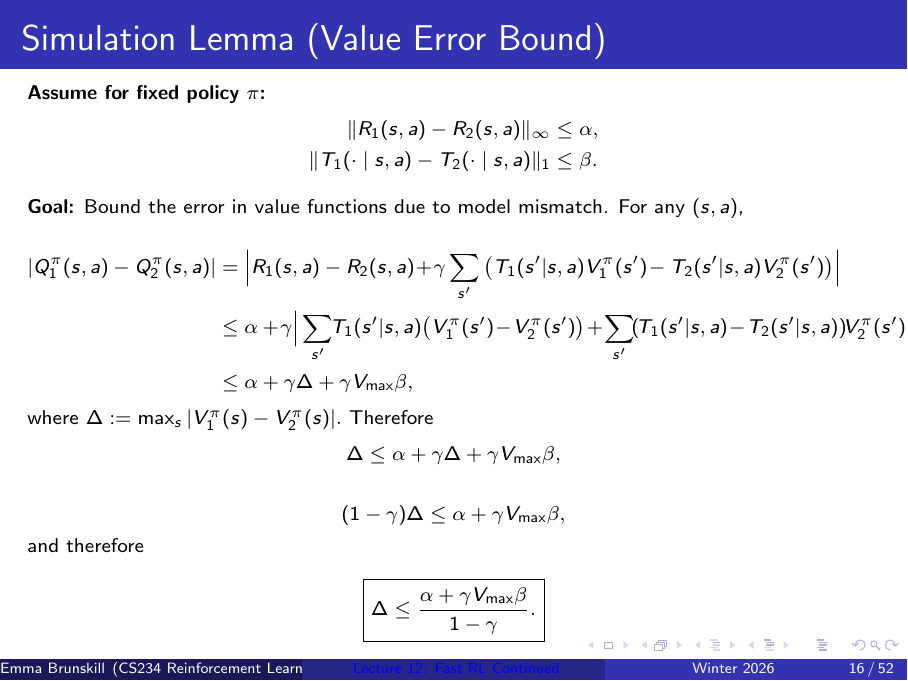
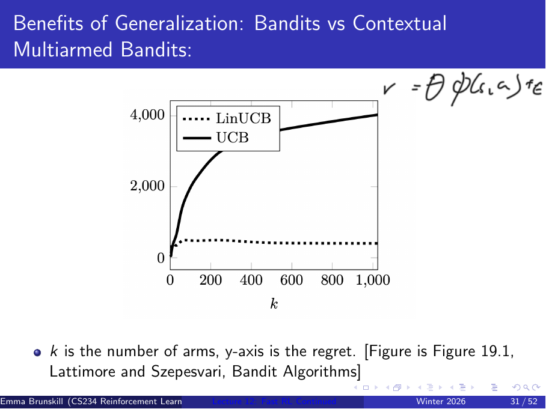
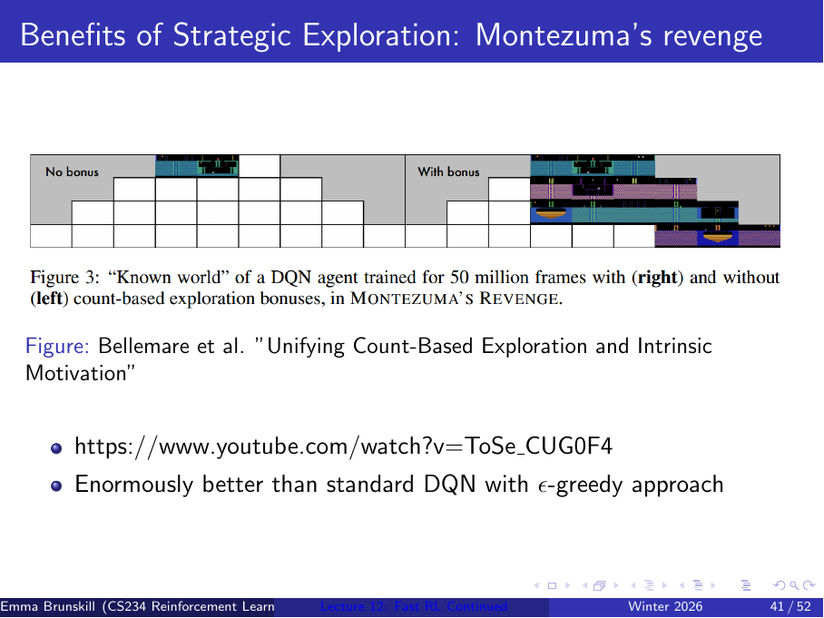
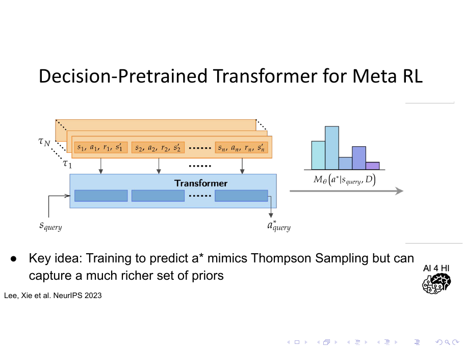

# CS234 Lecture 12 Notes: Fast RL Continued

来源：`lecture/lecture12post.pdf` 与 `lecture/lecture12pre.pdf`，CS234 Winter 2026，Emma Brunskill；PDF 标题为 `Lecture 12: Fast RL Continued`。两份 deck 的教学内容基本一致；本笔记以 post deck 为主，pre deck 用于核对符号。PDF 文件有 54 个物理页面，课件页脚编号为 1--52，其中包含重复的动画/构建页。

笔记规范：`cs234-rl-tutor v2`。覆盖清单表示课件内容已经写入，不表示学习者已经掌握。

外部资料核验日期：2026-08-14（延伸阅读中的课程引用按本地课件书目核对；“前沿动态”不额外宣称最新或最优）。

## 0. 本讲覆盖清单

- [x] 第 1--3 页：Beta prior、Thompson sampling 复习题及答案；写入 §1 与 §3。
- [x] 第 4--6 页：课程位置、settings/frameworks/approaches、目录；写入 §1。
- [x] 第 7--9 页：regret 与 PAC 的差别、PAC 定义、optimism/Thompson sampling；写入 §2。
- [x] 第 10--12 页：MDP 中的 PAC、MBIE-EB 算法及 exploration bonus；写入 §2.3。
- [x] 第 13--15 页：PAC for MDPs、MBIE-EB 的 PAC 结论、simulation lemma 动机；写入 §2.2--§2.4。
- [x] 第 16 页：simulation lemma 的值误差推导；写入 §2.4。
- [x] 第 17--19 页：目录回顾、Bayesian bandit 与 Bernoulli--Beta 更新复习；写入 §3.1。
- [x] 第 20--23 页：Thompson sampling、Bayesian model-based RL、probability matching、PSRL；写入 §3.2。
- [x] 第 24--26 页：理解检查、答案、Seed Sampling/Concurrent PSRL 复现；写入 §3.3。
- [x] 第 27--29 页：generalization 与 strategic exploration 的问题设置；写入 §4.1 与 §5.1。
- [x] 第 30--34 页：contextual bandit、LinUCB 对比图、线性与 disjoint 线性模型、不确定性集合；写入 §4.2--§4.4。
- [x] 第 35--38 页：回到 generalization/optimism、MBIE-EB 的 tabular 限制；写入 §5.1。
- [x] 第 39--41 页：函数逼近中的 exploration bonus、过时 bonus、Montezuma's Revenge 图；写入 §5.2--§5.3。
- [x] 第 42--44 页：表示/参数上的 Thompson sampling、Bootstrapped DQN、Bayesian deep Q-network；写入 §5.4。
- [x] 第 45--47 页：meta-learning for exploration、Decision-Pretrained Transformer、课程总结；写入 §6--§7。
- [x] 第 48--50 页：下一讲 MCTS、tabular MDP 的 regret/PAC 理论、函数逼近理论；写入 §7.2。
- [x] 第 51--52 页：目录回顾、跨任务探索与 DREAM；写入 §6.3 与 §7.2。

重复的目录页和重复构建页不另造第二套解释；它们在清单中保留，以证明物理页覆盖完整。

## 1. 本讲主线

与 Lecture 11 的关系：Lecture 11 把 Bayesian bandit 的 prior/posterior 和 Thompson sampling 讲到 arm 层面。
本讲把同一思想推进到 MDP：未知的不只是每个动作的 reward distribution，还包括 transition dynamics；同时把评价标准从 regret 扩展到 PAC，并讨论当状态/动作空间很大时，如何用 generalization 保留可用的不确定性估计。

**本讲路线图**

1. 先区分 regret 与 PAC：前者累计所有 gap，后者关注“不够接近最优”的次数是否有限且为多项式级。
2. 在 tabular MDP 中用 MBIE-EB 和 simulation lemma 说明，模型误差、乐观初始化与 exploration bonus 如何连接到 PAC。
3. 把 Bayesian bandit 的 posterior sampling 扩展为 Bayesian model-based RL/PSRL：抽一个可能的 MDP，规划，再执行并更新 posterior。
4. 进入大状态空间：用 contextual/linear model 做 generalization，再把 optimism 或 Thompson sampling 接到函数逼近控制上。
5. 最后把问题推向 meta-RL：跨任务学习任务结构，使探索本身可以被学习。

本讲的主线不是提出一个适用于所有规模的单一算法，而是比较“评价标准、探索原则和表示方式”三层选择。

Lecture 11 主要问：**在 bandit 里，不知道每个 arm 的 reward 参数时，怎么探索？**

这一讲进一步问：**到了 MDP 里，不仅 reward 不知道，连 transition dynamics 都不知道，怎么探索？以及我们应该用什么标准评价“学得好不好”？**

## 2. PAC：从累计损失到近似正确的次数

与 Lecture 11 的关系：Lecture 11 用 regret 和 `within-$\epsilon$` toy 指标区分“损失大小”和“是否够接近最优”；本节把这个直觉正式化到 MDP，并说明为什么模型误差会影响最终价值。

**本节路线图**

1. 把 settings、frameworks 和 approaches 分开，避免把“评价算法”和“构造算法”混为一谈。
2. 定义 PAC 中的 $\epsilon$、$\delta$ 和多项式次数界，并与 regret 对照。
3. 用 MBIE-EB 展示 tabular MDP 中的 optimism、模型估计和规划如何串起来。
4. 用 simulation lemma 把 reward/dynamics 的误差传到 value/Q 误差。

### 2.1 Settings、frameworks 与 approaches

课件把问题拆成三层：

- **Settings**：bandit 是单步决策；MDP 具有状态、动作和长期转移。
- **Frameworks**：用什么标准评价“好”。课件回顾 empirical performance、convergence/asymptotic convergence、regret，并在本讲加入 PAC；Lecture 11 还讨论过 Bayesian regret。 
- **Approaches**：为某个 setting 和评价标准 设计探索方法，例如 greedy、$\varepsilon$-greedy、optimism under uncertainty、Thompson sampling。

课件的目标是让 RL 在大而复杂的领域中更快、更有效。这里的“快”可能指样本效率，也可能牵涉每步计算成本；后面的 PSRL 和函数逼近会分别暴露这两个维度的取舍。

Bandit 中基本是：
$a_t\rightarrow r_t$

做一个动作，得到 reward。

而 MDP 是：
​$s_t,a_t\rightarrow r_t,s_{t+1}$

所以 MDP 多了 state 和 transition dynamics。

PAC是评价标准

而MBIE-EB 是 具体的探索方法

### 2.2 Regret 与 PAC 的区别

对当前状态 $s_t$，令最优动作价值为 $Q^\star(s_t,a^\star)$。一个动作 $a_t$ 是 $\epsilon$-optimal：

$$
Q^\star(s_t,a_t)
\ge
\max_{a\in\mathcal A}Q^\star(s_t,a)-\epsilon.
$$

这个不等式只问“离最优是否不超过容许误差 $\epsilon$”，不关心它比最优差了 $0.01$ 还是 $0.05$。$\epsilon$ 是近似容忍度，不是 reward noise 的标准差；$Q^\star$ 是真实最优 action-value，而不是当前估计值。

在概率至少为 $1-\delta$ 的事件上，如果除去至多 $N$ 个时间步后所有动作都 $\epsilon$-optimal，且

$$
N=\operatorname{poly}\left(
|\mathcal S|, |\mathcal A|,
\frac{1}{1-\gamma},
\frac{1}{\epsilon},
\frac{1}{\delta}
\right),
$$

就称算法具有 PAC 风格的保证（课件在 tabular MDP 语境下使用这个定义）。

> 以至少 1−δ 的概率，在整个学习过程中，不够 ϵ-optimal 的时间步最多只有 N 个。

整体含义是：高概率地，真正“不够好”的决策次数 只随问题参数多项式增长，而不是随无限长运行时间线性增长。它不是说每一步都正确，也不是说 regret 必然最小。

PAC 在统计 你整个学习过程中， 到底有多少次错犯的比较离谱。 把整个无限长的学习过程看完，不够好的时间步，总数最多只有 N 个

我有至少  1−δ  的概率把握 保证：这个 RL 算法一生之中，“明显做错”的次数不会超过 N。

$N=\operatorname{poly}\left(|\mathcal S|,|\mathcal A|,\frac{1}{1-\gamma},\frac{1}{\epsilon},\frac{1}{\delta}\right)$

**不是一个可以直接计算的具体公式。**

这里的 poly(⋅)

是 **polynomial，多项式** 的缩写。意思是：

> N 可以被这些量的某个“多项式函数”控制住。

---

ϵ：允许有多不准

$Q^*(s,a_t)\ge Q^*(s,a^*)-\epsilon$

ϵ 越小，要求越严格。

δ：允许这个理论保证失败的概率有多大

PAC 通常说：

$P(\text{PAC 保证成立})\ge1-\delta$

例如： $\delta=0.05$
就是至少 95% 概率理论保证成立。

Regret 则把每一步的 gap 都加起来：一次 gap 很大的错误和多次 gap 很小的错误会产生不同的累计损失；PAC 可能把后者视为已经合格，他只统计不够好的次数 。两者是互补评价，不应互相替代。

$\operatorname{Regret}(T)=\sum_{t=1}^{T}\left[Q^*(s_t,a^*)-Q^*(s_t,a_t)\right]$

课件指出，许多 PAC 算法建立在 optimism 或 Thompson sampling 上；optimism 的一个简单实现是把未知动作的初始价值设为一个对该问题足够高的值，让“未了解”本身先触发探索。

> [!example] 反例对比：同一个动作如何得到不同评价
> 设最优动作价值为 $1.00$，动作 $a_1$ 的价值为 $0.96$，动作 $a_2$ 的价值为 $0.20$，取 $\epsilon=0.05$。一次选择 $a_1$ 的 regret gap 是 $0.04$，且它属于 within-$\epsilon$；一次选择 $a_2$ 的 gap 是 $0.80$，并且不满足 PAC 的近似合格条件。
>
> 这里的数值是说明用数据，非课件原例。它说明 PAC 更像“错误计数器”，regret 更像“损失积分器”：只看其中一个会丢掉另一种风险。

### 2.3 MBIE-EB：tabular MDP 中的 optimism

怎么设计一个PAC 算法：

**Model-Based Interval Estimation with Exploration Bonus（MBIE-EB）** 是课件给出的 tabular PAC RL 例子，引用 Strehl and Littman (2008)。它维护经验 reward/transition model，再在规划时加入随访问次数下降的 bonus。

可以把它理解成 MDP版本的 UCB / optimism

MDP 需要知道：

reward model  $R(s,a)$ ， 它是一个期望奖励，不是单单一次观察的r
$R(s,a)=\mathbb E[r\mid s,a]$ ， 通过反复采样，用平均值估计

transition model  $T(s'\mid s,a)$

初始化参数为 $\epsilon,\delta,m$，并令

$$
\beta
=
\frac{1}{1-\gamma}
\sqrt{0.5\log\frac{2|\mathcal S||\mathcal A|m}{\delta}}.
$$

这里 $m$ 是算法的样本/计数阈值参数，$\beta$ 把置信尺度和折扣造成的长期放大合在一起。课件页的字体和 OCR 在 $\epsilon,\delta$ 处有损坏；pre/post deck 的 PAC 定义均支持采用标准的 $\epsilon$（近似误差）和 $\delta$（失败概率）记号。

MBIE-EB 算法的数据流是：
$$
\text{counts}
\longrightarrow
\text{empirical }\widehat R,\widehat T
\longrightarrow
\text{optimistic }\widetilde Q
\longrightarrow
\text{greedy action}
\longrightarrow
\text{new counts}.
$$

按课件伪代码，主要步骤如下：

1. 对每个 $(s,a,s')$ 初始化转移计数 $n_{sas'}=0$，对每个 $(s,a)$ 初始化访问计数 $n_{sa}=0$、reward 运行均值 $r_c(s,a)=0$，并把 $\widetilde Q(s,a)$ 初始化为 $1/(1-\gamma)$。
	$n_{sa}$ 表示 (s,a) 一共访问过多少次，$n_{sas'}$ 表示 做 (s,a) 以后，有多少次转移到了 s′

2. 在当前状态选择
   $$
   a_t\in\arg\max_{a\in\mathcal A}\widetilde Q(s_t,a).
   $$

3. 观察 $r_t,s_{t+1}$，更新 $n_{sa}$ 和 $n_{sas'}$，并用增量平均得到经验 reward：
   $$
   r_c(s_t,a_t)
   \leftarrow
   \frac{r_c(s_t,a_t)(n_{s_ta_t}-1)+r_t}{n_{s_ta_t}}.
   $$

4. 构造经验模型：
$$
   \widehat R(s_t,a_t)=r_c(s_t,a_t),
   \qquad
   \widehat T(s'\mid s_t,a_t)
   =
   \frac{n_{s_ta_ts'}}{n_{s_ta_t}}.
   $$

5. 在模型上反复做 optimistic Bellman backup，直到收敛：
	$$
   \widetilde Q(s,a)
   =
   \widehat R(s,a)
   +\gamma\sum_{s'\in\mathcal S}
   \widehat T(s'\mid s,a)\max_{a'\in\mathcal A}\widetilde Q(s',a')
   +\frac{\beta}{\sqrt{n_{sa}}}.
   $$

之前把$\widetilde Q(s,a)$ 初始化为 $1/(1-\gamma)$， 假设reward 最大是 1，那么无限 horizon discounted return 最大就是： $1+\gamma+\gamma^2+\cdots$= $\frac1{1-\gamma}$

这相当于说：

> 对一个完全没见过的 (s,a)，我先假设它有可能达到理论最大值，都是最好的动作。

这就是： optimistic initialization​

一旦某个 (s,a) 被实际访问，算法就开始用观察到的数据重新计算它的 Q​(s,a)，于是它会逐渐从最大值往真实值下降

前两部分其实就是你以前学的 Bellman optimality backup：
$$R+\gamma\mathbb E[V(s')]$$

$\frac{\beta}{\sqrt{n_{sa}}}$  这就是 exploration bonus。

$\beta$  控制 **bonus 的总体大小**

 bonus 随 $n_{sa}$ 增加而下降；访问少的 pair 看起来更有希望，从而诱导探索。最后一项是标量加到 action-value backup 上，不是 transition probability，也不是对 reward observation 的额外真实奖励。

之前在 bandit / UCB 里可能看到的是这种：
​​
$U_t(a)=\widehat Q_t(a)+\sqrt{\frac{2\log t}{N_t(a)}}$

以前 bandit 很简单：

UCB=当前 reward/Q 的估计+不确定性 bonus​

因为 bandit 做完动作拿 reward 就结束了，没有“下一个状态”。

但是现在是 MDP，做完 a 以后还会进入 s′，后面还有未来 reward。

所以基础价值不是简单的 reward mean，而是 Bellman backup：

$\widehat R(s,a)+\gamma\sum_{s'}\widehat T(s'\mid s,a)\max_{a'}\widetilde Q(s',a')$

然后再在它上面加：

$$+\frac{\beta}{\sqrt{n_{sa}}}$$

所以现在可以理解成：

Q​=利用经验 MDP 算出来的 Q​​+探索不确定性 bonus​​​

这和 UCB 的结构一模一样。

一般δ 表示置信失败概率

$P\left(Q_{\text{true}}(s,a)\le\widehat Q(s,a)+\text{bonus}\right)\ge 1-\delta$

---

需要的是 optimism under uncertainty , 而不是 greddy

假设 action A 已经尝试了 1000 次：
$n_{sA}=1000$

经验 reward 看起来是 0.6。

另一个 action B：
$n_{sB}=1$

只试了一次，恰好 reward 是 0.4。

如果纯 greedy：

> 0.6 > 0.4，于是以后永远选 A。

可是 B 只试了一次。

它真实 reward 完全可能是 0.9。

你根本没有足够证据认为 B 差。

所以需要 **optimism under uncertainty**：

> 越不确定的 (s,a)，越额外给它一点“乐观值”。

课件第 14 页直接把 MBIE-EB 标为 PAC RL algorithm；这个标签依赖其 tabular、折扣和置信界假设，不应推广为任意函数逼近实现都自动 PAC。

课件伪代码没有展开 $n_{sa}=0$ 时 bonus 分母的实现细节；初始化 $\widetilde Q=1/(1-\gamma)$ 已经表达了“未访问 pair 先按高价值看待”的 optimism。实际代码需要显式规定未访问 pair 的 bonus/cap 处理，不能直接让除零发生。

> [!example] 具体计算：bonus 为什么会随访问次数下降
> 假设某个 pair 的经验 Bellman 部分为 $0.6$，$\beta=2$。第一次访问后若 $n_{sa}=1$，bonus 是 $2$，optimistic target 为 $2.6$；访问到 $n_{sa}=16$ 时，bonus 变为 $2/4=0.5$，target 降为 $1.1$。
>
> 这是说明用数据，非课件原例。它只展示探索压力如何随信息增加减弱，不代表 MBIE-EB 的完整收敛数值。

### 2.4 Simulation lemma：模型误差如何传到 value 误差

课件把 simulation lemma 作为 MBIE-EB PAC 论证的关键思想：如果经验模型的 reward 和 dynamics 足够接近真实模型，那么固定策略下的 value/Q 也不会差得太远。

上面假设：

> **只要我的 R^ 和 T^ 越来越接近真实的 R,T，那么我算出来的 Q/ value 就会越来越接近真实 Q/value。**

这节来证明上面这个观点：

对固定策略 $\pi$，假设两个 MDP 的 reward 和 transition 满足

$$
\left\|R_1-R_2\right\|_\infty\le\alpha,
\qquad
\left\|T_1(\cdot\mid s,a)-T_2(\cdot\mid s,a)\right\|_1\le\beta
\quad\forall(s,a).
$$

令

$$
\Delta=\max_s\left|V_1^\pi(s)-V_2^\pi(s)\right|,
\qquad
V_{\max}\ge\max_s\left|V_2^\pi(s)\right|.
$$
这个 Δ 就是：
> 两个 MDP 在执行同一个 policy π 时，最大的 value 差异。

Simulation Lemma 想证的就是：

α,β 很小⟹Δ 也很小​

则推导得到

$$
\left|Q_1^\pi(s,a)-Q_2^\pi(s,a)\right|
\le
\alpha+\gamma\Delta+\gamma V_{\max}\beta,
$$

$$|Q_1-Q_2|\le\underbrace{\alpha}_{\text{reward 错}}+\underbrace{\gamma\Delta}_{\text{未来 value 本身错}}+\underbrace{\gamma V_{\max}\beta}_{\text{transition probability 错}}$$

第二部分是： 虽然两个到达同一个 next state，但这个 state 的 value 就有误差，两者取到的value值不相同

第三部分：

假如真实 transition 是：

$P(s_{\text{good}}\mid s,a)=0.8$

$P(s_{\text{bad}}\mid s,a)=0.2$

但是经验模型估计错了一点：

$\widehat P(s_{\text{good}}\mid s,a)=0.7$

$\widehat P(s_{\text{bad}}\mid s,a)=0.3$

于是：
$\left|\mathbb E_P[V(s')]-\mathbb E_{\widehat P}[V(s')]\right|=1$

所以即使：

V(s′) 本身完全没错，**只要“去各个 s′ 的概率”错了，最后的加权平均就会错**

Bellman equation 里的 future value 是：

$\sum_{s'}P(s'\mid s,a)V(s')$

另一个模型使用：

$\sum_{s'}\widehat P(s'\mid s,a)V(s')$

两者相减：

$\left|\sum_{s'}P(s'\mid s,a)V(s')-\sum_{s'}\widehat P(s'\mid s,a)V(s')\right|$

把 V(s′) 提出来：
​$=\left|\sum_{s'}\left(P(s'\mid s,a)-\widehat P(s'\mid s,a)\right)V(s')\right|$

然后用三角不等式：

$\le\sum_{s'}\left|P(s'\mid s,a)-\widehat P(s'\mid s,a)\right|\left|V(s')\right|$

假设每个 state 的 value 都不会超过：

$|V(s')|\le V_{\max}$

所以刚才那个式子：
​
$\le V_{\max}\sum_{s'}\left|P(s'\mid s,a)-\widehat P(s'\mid s,a)\right|$

而如果课件定义 transition error：

$\sum_{s'}\left|P(s'\mid s,a)-\widehat P(s'\mid s,a)\right|\le\beta$

那么立刻得到：

$\left|\mathbb E_P[V(s')]-\mathbb E_{\widehat P}[V(s')]\right|\le V_{\max}\beta$
​

---

从而推得：

$$
\boxed{
\Delta
\le
\frac{\alpha+\gamma V_{\max}\beta}{1-\gamma}
}.
$$

第一条不等式的意思是：当前 reward 误差贡献 $\alpha$；下一状态价值的差异贡献 $\gamma\Delta$；transition 分布误差在价值上最多贡献 $\gamma V_{\max}\beta$。

把所有下一状态的误差加总后，固定点结构把 $\gamma\Delta$ 移到左侧，因此出现 $1/(1-\gamma)$ 的长期放大，得到方框不等式。

为什么左边也变成Δ 形式

对于 MDP 1：
$V_1^\pi(s)=\sum_a\pi(a\mid s)Q_1^\pi(s,a)$

对于 MDP 2：
$V_2^\pi(s)=\sum_a\pi(a\mid s)Q_2^\pi(s,a)$

所以两者相减：
$$V_1^\pi(s)-V_2^\pi(s)=\sum_a\pi(a\mid s)\left(Q_1^\pi(s,a)-Q_2^\pi(s,a)\right)$$
我们已经知道每个动作都满足：

$\left|Q_1^\pi(s,a)-Q_2^\pi(s,a)\right|\le\alpha+\gamma\Delta+\gamma V_{\max}\beta$

因此：

$\left|V_1^\pi(s)-V_2^\pi(s)\right|\le\sum_a\pi(a\mid s)\left(\alpha+\gamma\Delta+\gamma V_{\max}\beta\right)$

而：
$\sum_a\pi(a\mid s)=1$

所以：

$\left|V_1^\pi(s)-V_2^\pi(s)\right|\le\alpha+\gamma\Delta+\gamma V_{\max}\beta$

*图：`lecture/lecture12post.pdf` 物理 PDF 第 16 页，课件原始 simulation lemma 推导。图中 $\alpha,\beta,\Delta,V_{\max}$ 的记号保留原样；正文补充了每一项的来源。*

推导依赖 $\gamma<1$ 和有界 value。$\|\cdot\|_1$ 是对下一状态分布差异的总绝对质量，不能误读为两个 transition 向量的逐坐标最大差。该 lemma 是固定策略的 value error bound；要把它直接变成最优策略或 PAC 结论，还需要额外的模型置信和规划论证。

## 3. Bayesian MDP 与 Posterior Sampling

与 Lecture 11 的关系：Lecture 11 中每个 arm 只有未知 reward distribution；本节把 posterior 的对象扩大为完整 MDP 模型 $P,R$。Thompson sampling 的“抽一个可能世界再行动”保留不变，但在抽样后必须做 MDP planning。

**本节路线图**

1. 回顾 Bayesian bandit 的 prior、posterior 和 Beta--Bernoulli 更新。
2. 把 posterior 扩展到 transition 与 reward model。
3. 写出 probability matching 的 MDP 形式和 PSRL episode loop。
4. 用课件理解检查区分策略影响数据分布、规划成本和 posterior 更新频率。

将 Lecture 11 学的 **Bayesian bandit + Thompson Sampling** 整体搬到 MDP 里

### 3.1 Bayesian bandit refresher

*首次完整讲解：Lecture 11 §2.2「Bayesian inference 的对象」和 §3.2「Posterior update」。本节只补充：这些对象如何成为 Bayesian MDP 的组件。*

Bayesian bandit 为未知 reward parameter 设 prior，观察 history 后维护 posterior $p[\mathcal R_a\mid h_t]$。课件再次强调：posterior 可以支持 Bayesian UCB 或 probability matching/Thompson sampling，但 prior 不准确时性能可能变差。 

	posterior 本身只是我们对未知 reward parameter 的认识。至于接下来怎么根据 posterior 选动作，有很多不同方法。Bayesian UCB 和 Thompson Sampling 就是两种不同的“使用 posterior 的方法”。

假设现在 arm a 的 posterior 是：
$p(\theta_a\mid h_t)$

Bayesian UCB 会从这个 posterior 中取一个比较靠右的值，比如 95% quantile：

$U_t(a)=q_{0.95}\left[p(\theta_a\mid h_t)\right]$

然后选：
$a_t=\arg\max_aU_t(a)$

但 TS 不去专门算一个 UCB。

而是直接从 posterior 里抽一个可能的参数：

$\widetilde\theta_a\sim p(\theta_a\mid h_t)$

每个 arm 都抽一个：

$\widetilde\theta_1,\widetilde\theta_2,\ldots,\widetilde\theta_K$

然后选择最大的：​

$a_t=\arg\max_a\widetilde\theta_a$

---

Bernoulli reward 的参数 $\theta$ 满足

$$
r\mid\theta\sim\operatorname{Bernoulli}(\theta),
\qquad
\theta\sim\operatorname{Beta}(\alpha,\beta).
$$

观察 $r\in\{0,1\}$ 后，posterior 为

$$
\theta\mid r\sim\operatorname{Beta}(\alpha+r,\beta+1-r).
$$

成功只增加第一个 shape 参数，失败只增加第二个。课件给出的 density 中 $\Gamma(\cdot)$ 是 Gamma function；Beta distribution 描述的是参数不确定性，不是一次 reward 本身。

### 3.2 Bayesian model-based RL 与 PSRL

在Bandit里 只需要考虑 reward

但MDP 中做：
$(s,a)$
我们需要知道P和R

所以 Bayesian model-based RL 不能只维护：

$p(R\mid h_t)$

而要维护：

$\boxed{p(P,R\mid h_t)}$

在 Bayesian model-based RL 中，history 可写成

$$
h_t=(s_1,a_1,r_1,\ldots,s_t),
$$

算法维护

$$
p[P,R\mid h_t],
$$

即 transition model $P$ 与 reward model $R$ 的联合 posterior。它们共同决定未来轨迹分布；只估计 reward 而把 transition 固定为经验平均，并不等价于对完整 MDP 做 posterior sampling。

每次 observation 同时告诉你两件事：

1. 这个 (st​,at​) 的 reward 大概是什么；
2. 这个 (st​,at​) 会把你带到哪里。

所以同一条 trajectory 同时更新： $R(s,a)$  和 $P(\cdot\mid s,a)$  的 posterior $p[P,R\mid h_t],$

MDP 版本的 probability matching 为

$$
\begin{aligned}
\pi(a\mid s,h_t)
&=\mathbb P\left[
Q(s,a)\ge Q(s,a')\ \text{for all }a'\ne a
\mid h_t
\right]\\
&=\mathbb E_{P,R\mid h_t}
\left[
\mathbf 1\left(
a\in\arg\max_{a'\in\mathcal A}Q_{P,R}^\star(s,a')
\right)
\right].
\end{aligned}
$$
和前面 TS 学过的 一样：

> **选 action a 的概率 = posterior 下 a 是 optimal action 的概率。**

MDP posterior   ⇒  Q posterior⇒哪个 action 最优的概率​

我们从 posterior 中随机抽一个 MDP：

$(P,R)\sim p(P,R\mid h_t)$

然后对于这个抽出来的 MDP，求：

$Q^*_{P,R}(s,a)$

这个符号就是说：

> **在刚刚抽出来的 transition P 和 reward R 构成的 MDP 中，计算它的最优 Q。**

然后判断：

$a\in\arg\max_{a'}Q^*_{P,R}(s,a')$

也就是：

> 在这个抽出来的 MDP 里，a 是不是最优动作？

如果是，则指示函数为1。 然后对很多的MDP 可能做平均

左边是“在 posterior 认为的可能 MDP 中，动作 $a$ 成为最优的概率”；右边是抽一个完整模型后，看该模型的最优规划是否选 $a$。

因此 Thompson sampling 在 MDP 中不是直接从每个动作的标量均值采样，而是从模型采样、规划，再执行该模型的最优动作。并列最优动作需要固定 tie-breaking 或随机规则；课件公式没有展开这一点。

==等式作用告诉你：==

> **我们不需要真的把“动作 a 是最优的概率”计算出来。**

你如果真的想计算：

P(a1​ 是最优∣ht​)

就得考虑：

> posterior 里面所有可能的 transition P、所有可能的 reward R，对于每一个 MDP 都求一次最优 policy，然后统计有多少情况下 a1​ 最优。

Thompson Sampling 采用：
每一轮直接：
第一步：从 posterior 分布 抽一个完整 MDP

$(\widetilde P,\widetilde R)\sim p(P,R\mid h_t)$

第二步：在这个 MDP 中 算： $Q^*_{\widetilde P,\widetilde R}$

第三步：选这个 MDP 认为最优的动作

$a_t=\arg\max_aQ^*_{\widetilde P,\widetilde R}(s_t,a)$

和之前bandit 很类似。也就是后面的PSRL流程

不同的是，它多了planning部分：把刚刚从 posterior 里抽出来的 MDP 暂时当作真实环境，然后在这个 MDP 里面求最优 Q 和最优策略

>	可以通过之前学过的Value Iteration去解V，然后利用V去算Q。 策略的话就是：在每个状态s中 $\pi^*(s)\in\arg\max_a Q^*(s,a)$。 Q∗=现在的 reward+未来最优情况下的 reward

PSRL（Posterior Sampling for Reinforcement Learning，Osband, Russo, Van Roy, NeurIPS 2013）的 episode 流程为：

1. 为每个 $(s,a)$ 初始化 dynamics 和 reward 的 prior。
2. 第 $k$ 个 episode 开始时，从 posterior 采样一个 MDP $M$，即对每个 pair 采样 $T_M(s'\mid s,a)$ 和 $R_M(s,a)$。
3. 对 sampled MDP 做规划planning，得到最优 action-value $Q_M^\star$。课件为简洁起见使用 stationary 写法；若把 episode 的剩余步数显式放进状态，严格的 finite-horizon 记号应写成 $Q_{M,t}^\star$ 或 $Q_{M,h}^\star$。
4. 在长度为 $H$ 的 episode 中执行
   $$
   a_t\in\arg\max_{a\in\mathcal A}Q_M^\star(s_t,a),
   $$

   观察 $r_t,s_{t+1}$。
5. 用实际观察到的 reward/next state 按 Bayes rule 更新被访问 pair 的 posterior，进入下一 episode。

数据流可以写成：

$$
\text{posterior over }(P,R)
\to
\text{sampled MDP}
\to
\text{planning}
\to
\text{episode actions}
\to
\text{observations}
\to
\text{posterior update}.
$$

与 Lecture 11 的 bandit TS 相比，新增成本是 planning；但探索来源仍是 posterior 不确定性，而不是手工给每个 action 加固定随机噪声。

> [!example] 具体计算：一次 PSRL episode 的动作来源
> 假设 posterior 抽到的 sampled MDP $M$ 中，当前状态 $s$ 的规划结果是 $Q_M^\star(s,a_1)=2.0$、$Q_M^\star(s,a_2)=1.7$。本 episode 选择 $a_1$，即使当前经验均值对 $a_2$ 更高；因为动作依据的是 sampled model 的长期最优价值，而不是一个单步 reward 均值。
>
> 这是说明用数据，非课件原例。观察到 transition 和 reward 后，更新的是模型 posterior；$2.0$ 这个候选 Q 值本身不是观测。

### 3.3 理解检查与 Concurrent PSRL

课件第 24--25 页的答案应这样读：

- **策略影响数据分布**：错误。MDP 中后续访问哪些状态取决于当前策略，所以 strategic exploration 会改变可获得的数据。
- **对 dynamics 和 reward 都做 optimism**：正确。构造乐观 Q 时，未知转移和未知奖励都可能贡献不确定性。
- **PAC 是指数次数界**：错误。课件要求的是对问题参数的多项式次数界。
- **用 reward 的 posterior、dynamics 的经验平均就有同样性能**：错误。这样不再是对完整 MDP posterior sampling，通常不能直接继承同一理论/行为结论。
- **可以在 posterior 更新后重新规划**：课件把这一项判为正确，但伪代码的粒度存在张力：它在每个 episode 开始时规划一次，同时在每步更新 posterior。更稳妥的理解是“重规划是可选计算设计”，而不是声称每个版本都必须逐步规划。
- **每步计算成本总与 Q-learning 相同**：错误。PSRL 需要 sampled-MDP planning；规划频率不同，成本也会不同。

第 26 页的 **Seed Sampling and Concurrent PSRL** 复现了相同的 sample--plan--execute--update 结构，并给出 Dimakopoulou and Van Roy (ICML 2018) 及[课件视频](https://www.youtube.com/watch?v=xjGK-wm0PkI)。课件没有在该页展开与基础 PSRL 不同的证明或数据结构，因此本笔记只记录它作为并发/种子采样方向的延伸，不虚构额外步骤。

## 4. Generalization：把探索扩展到大空间

与第 3 节的关系：tabular Bayesian MDP 为每个 $(s,a)$ 保留独立的模型不确定性；当状态/动作空间巨大时，独立计数和独立 posterior 不再可行。本节用函数表示状态--动作关系，让一次观察能够影响相似输入。

前面 MBIE-EB 和 PSRL 都默认：每个状态/动作，甚至每个 (s,a)，都可以自己收集足够多的数据。  
但如果状态空间特别大，甚至是连续的，这就完全做不到。

第四节引入 **Generalization（泛化）**：

不再给每个 (s,a) 单独学一个值，而是让相似的 (s,a) 共享信息​

**本节路线图**
1. 先从普通 bandit 加入 context，明确 reward distribution 的条件化对象。
2. 用线性 feature model 表示 context/action 与 reward 的关系。
3. 区分共享参数模型和每个 arm 独立参数的 disjoint 模型。
4. 说明 scalar Hoeffding 置信区间为何要升级为 vector parameter 的 uncertainty set。

### 4.1 Contextual multi-armed bandit

普通 bandit 可以写成 $(\mathcal A,\mathcal R)$：动作 $a$ 的 reward distribution $\mathcal R_a$ 不随 context 改变。contextual bandit 增加 context/state space $\mathcal S$，并令

$$
\mathcal R_{a,s}(r)=P[r\mid a,s].
$$
同一个 action，在不同 context 下，reward distribution 可以完全不同。

每轮先看到 $s_t$，再选择 $a_t$，环境按照 $r_t\sim\mathcal R_{a_t,s_t}$ 产生 reward。目标仍是最大化
$$
\sum_{t=1}^{T}r_t
$$

或最小化 regret，但“哪个动作好”现在依赖 $s_t$。

当 $|\mathcal S|$ 或 $|\mathcal A|$ 很大时，不能为每个 $(s,a)$ 单独维护一个均值；需要用 $\phi(s,a)$ 等特征函数表示输入与 reward 的关系。这就是 generalization 的来源：相似特征可以共享统计信息。

*图：`lecture/lecture12post.pdf` 物理 PDF 第 31 页，课件引用 Lattimore and Szepesvári *Bandit Algorithms* 的 Figure 19.1。

横轴 $k$ 是 arm 数，纵轴是 regret；图中 LinUCB 曲线利用结构共享，随 $k$ 增大明显低于普通 UCB。

普通UCB：
k↑⇒需要探索的独立对象越来越多⇒regret↑

arm数量变多，选到次优arm的次数也变多，regret 自然就变大

LinUCB：
它学习的是共享的：θ

而不是给每个 arm 完全独立地学习一个参数。

只要 feature dimension d 没有增加太多，那么即使：k=1000

也不意味着有 1000 个完全独立的问题。

因为所有 arm 都通过： Q(s,a)=θ⊤ϕ(s,a)

联系起来。

这张图只说明一种结构性收益，不应读成“所有 linear contextual algorithm 都必然优于所有 tabular algorithm”。收益依赖 feature 表示、噪声、参数假设和算法实现是否匹配。

### 4.2 线性 contextual bandit

课件给出的线性 reward model 是

$$
r_t=\theta^\top\phi(s_t,a_t)+\varepsilon_t,
\qquad
\varepsilon_t\sim\mathcal N(0,\sigma^2).
$$

这里 $\phi(s,a)\in\mathbb R^d$ 是已知 feature 向量，它描述当前的 context 和 action，已知。 $\theta\in\mathbb R^d$ 是未知参数，告诉你 每种feature 对 reward 有多重要，然后将每个feature计算求和得到一个标量。 $r_t$ 是标量 reward，$\varepsilon_t$ 是观测噪声，就算st,at完全一样，reward 也有随机性

还没有transition probability P，是因为这里还不是MDP，contextual bandit 没有 MDP 那种“动作影响未来状态”的问题。

公式的整体含义是：不再为每个 context/action 对单独估计 reward，而是用一个共享参数向量预测其条件均值

$$\mathbb E[r_t\mid s_t,a_t]=\theta^\top\phi(s_t,a_t)$$

假设：
$\theta=\begin{bmatrix}2\\1\end{bmatrix}$

一个 state-action pair 的 feature：
$\phi(s_1,a_1)=\begin{bmatrix}1\\0.5\end{bmatrix}$

那么 expected reward：

$2\times1+1\times0.5=2.5$

现在来了一个从没见过的新 pair： (s2​,a2​)

但 feature 是：

$\phi(s_2,a_2)=\begin{bmatrix}0.9\\0.6\end{bmatrix}$

即使你**从来没有访问过这个 pair**，也能预测： $\hat r=\theta^\top\phi(s_2,a_2)$

这就是 generalization。

以前的bandit：
学习很多 scalar：

$Q(s,a)$

每个 (s,a) 一个。

Linear contextual bandit 是 学习一个 vector： $\theta$

然后： $Q(s,a)=\theta^\top\phi(s,a)$

这改变了 uncertainty 的对象：Lecture 9--10 中可以对一个 arm 的 scalar mean($\mu_a=\mathbb E[r\mid a]$) 使用 Hoeffding/sub-Gaussian bonus (用来推出他的置信区间宽度，这两个就是用不同的概率工具来证明 bonus 应该有多大)；

Hoeffding 通常用于：

reward 有界​

例如： r∈[0,1]

而 sub-Gaussian 假设是：

reward/noise 的尾部不能太重​

它允许更一般的随机变量。

但现在不确定的不是一个值，而是一个向量 $\theta$。现在需要对整个 $\theta$ 建立 confidence set，再把该集合投影到当前的 $\phi(s,a)$ 上。课件没有在这里展开 LinUCB 或线性 TS 的完整更新式，只指出这种 uncertainty set 可以计算，并推荐 Chapelle and Li (2010) 或 *Bandit Algorithms* Chapter 19。

以前：
μa​ 只是一个数。我们通过不断采样去估计它，然后给他加上bonus

所以 confidence set 就是一条数轴上的区间：
μ​a​−ϵ ≤ μa​ ≤ μ​a​+ϵ

但是现在假设：
θ=[θ1​,θ2​​]

两个参数都不确定。

估计过程中，两个值都会波动，θ 位于 一个区域里。这个区域就叫：confidence set

confidence:

confidence interval 是因为我们用有限次抽样得到的均值 Q​ 会有随机波动，所以真实 Q 不一定刚好等于 $\widehat Q$​

然后 Hoeffding / sub-Gaussian inequality 告诉我们：

> 这种波动通常不会无限大。

例如可以推出，以至少 1−δ 的概率：
$|\widehat Q(a)-Q(a)|\le\epsilon$

这里的：ϵ

就是我们说的 **bonus / confidence radius**。

所以：

$Q(a)\in[\widehat Q(a)-\epsilon,\widehat Q(a)+\epsilon]$

这个区间才叫 confidence interval。

==UCB 则只取上半部分==
bonus会随着你的sample 次数变多从而越来越小

投影：

虽然我们不确定的是整个：θ

但真正选动作的时候，我们关心的不是：

> θ 本身到底是多少？

而是关心： θ⊤ϕ(s,a)

因为这个才是 action a 的 predicted reward

### 4.3 Disjoint linear model

在 **disjoint linear contextual bandit** 中，每个 arm $a$ 有自己的参数 $\theta_a$：

$$
r_t=\theta_{a_t}^\top\phi(s_t)+\varepsilon_t,
\qquad
\varepsilon_t\sim\mathcal N(0,\sigma^2).
$$

共享模型的一个 $\theta$ 会让不同 arm 共享统计信息；disjoint 模型则只在同一个 arm 的样本之间共享。

假设 context：
ϕ(s)=[年龄,科技兴趣,体育兴趣]

Shared model 认为：

> 不同文章背后的 reward 规律可以共享一套参数。

而 disjoint model：

科技文章：$\theta_{\text{tech}}$`

体育文章：$\theta_{\text{sport}}$

电影文章：$\theta_{\text{movie}}$

每种 action 都自己学：
“什么样的用户喜欢我？

Shared：

共享更多，泛化更强​

优点：数据效率高。

缺点：如果 action 实际差别非常大，共享可能不合理。

Disjoint：

共享更少，更灵活​

优点：每个 arm 可以有不同规律。

缺点：每个 arm 都需要更多自己的数据。

所以这其实是在讨论：

> **到底应该让多少信息共享？**

---

但是：

Disjoint 虽然不在不同 arm 之间共享参数，但它仍然会在同一个 arm 的不同 context 之间泛化。就算你s不同，只要你选择同一个arm，都可以用这个公式进行计算
最早之前的：

你直接给每个状态动作对维护一个值：$Q(s,a)$

比如有：

Q(s1​,a1​),Q(s2​,a1​),Q(s3​,a1​)

虽然它们都是动作 a1​，但在 tabular 方法里，这三个基本是**三个独立的数**。

所以：

Tabular：每个 (s,a) 各学各的

课件理解检查问：能否用 $r=\theta^\top\phi(s,a)+\varepsilon$ 表示 disjoint model？
可以，只要把 arm 编码进 feature，例如把 $\phi(s,a)$ 做成按 arm 分块的 one-hot feature，令 $\theta$ 是所有 $\theta_a$ 的拼接向量。表面上是一个共享向量，结构上仍等价于每个 arm 一块互不共享的参数。

**Disjoint model 明明是“每个 arm 一套参数”，但我们可以把所有 arm 的参数拼成一个大向量，于是表面上也能写成统一的**：$r=\theta^\top\phi(s,a)+\varepsilon$ 

**但它本质上仍然是每个 arm 各用各的参数，没有真正共享。**

### 4.4 从 scalar concentration 到 vector uncertainty

线性模型下，一次观测对 $\theta$ 的多个方向提供信息(theta 是多维向量)；只看 reward scalar (标量) 的区间会丢失 feature 相关性。

算法需要维护一个关于 $\theta$ 的椭球或其他可计算 uncertainty set，再评估某个 $(s,a)$ 的可能最大预测值。

计算出的一次reward 是一个标量，但是theta是一个多维向量，是这个多维向量的联合约束产生了reward。$r=\theta^\top\phi(s,a)+\varepsilon$

比如计算出r=3:

我们知道当前：
ϕ=[1,1​]

观察到
r≈3

它是在告诉我们：
$\theta_1+\theta_2\approx3$

但是你仍然不知道：

θ=[1，2​] 还是：θ=[2，1​]

所以：
一个 scalar reward 只能给 θ 提供一部分信息​

再来下一次：

$\phi=\begin{bmatrix}1\\0\end{bmatrix}$

观察到：
r≈1

那么：r≈θ1​

所以我们知道：
$\theta_1\approx1$

再结合第一次：
θ1​+θ2​≈3

就可以推测：
θ2​≈2
所以：

==很多不同 feature 下的 scalar reward⇒逐渐确定整个 θ==

​
之前
普通 UCB 对每个 arm 单独估计一个数： ​$\mu_a=\mathbb E[r\mid a]$

它有一个一维区间，加减bonus。
例如：

μa ​∈ [0.6,0.8]

这就是一维 confidence interval

而这里：
$$\mu(s,a)=\mathbb E[r\mid s,a]=\theta^\top\phi(s,a)$$

如果你只给 “当前这个 action 的预测 reward” 画一个一维置信区间，你只知道这个 action 有多不确定，却不知道这种不确定性和 feature 的哪些方向有关，因此无法正确把这份信息泛化到其他 action。

所以 LinUCB 不只保存一个：r±bonus

而是保存整个：θ 的 uncertainty。
例如：

$\theta\in\mathcal C_t$

这个 Ct​ 是一个椭球状 confidence set。

它能够记录：

- 对 θ1​+θ2​ 这个方向可能很确定；
- 对 θ1​−θ2​ 这个方向可能还很不确定。

于是来了新的：
ϕ(s,a)

算法就可以问：

$\max_{\theta\in\mathcal C_t}\theta^\top\phi(s,a)$

也就是：

> **根据我对整个 θ 的认识，在当前这个 feature 方向上，reward 最大可能是多少？**

$\operatorname{UCB}(s,a)=\underbrace{\widehat{\theta}^{\top}\phi(s,a)}_{\text{estimated mean reward}}+\underbrace{\operatorname{bonus}(s,a)}_{\text{mean reward uncertainty}}$

$$\boxed{\operatorname{UCB}_t(s,a)=\hat\theta_t^\top\phi(s,a)+\alpha\sqrt{\phi(s,a)^\top V_t^{-1}\phi(s,a)}}$$
这里的bonus：假如给你大量的二维数据phi，但大部分都是第一维有值，第二维是0，所以代表我们训练第二维theta的数据很少。那下次碰到第二维不是0的phi， 则他的bonus会高一点，提高探索程度

---

算法需要维护一个关于 $\theta$ 的椭球或其他可计算 uncertainty set，再评估某个 $(s,a)$ 的可能最大预测值。

它体现了 **generalization 与 strategic exploration 的耦合**：

- generalization 决定哪些状态/动作可以共享数据；
- uncertainty model 决定哪些共享预测仍然不可靠；（也就是bonus）
- optimism 或 Thompson sampling 决定如何把不确定性转成下一步动作。

如果 feature 表示错误，泛化会把错误信息传播到相似输入；因此“大空间”并不自动意味着更快，表示假设本身也是算法的一部分。

参数怎么学出来的：

假设到现在已经有很多 observation：
$(\phi_1,r_1),\;(\phi_2,r_2),\ldots,(\phi_t,r_t)$

$\phi_i=\phi(s_i,a_i)$

而模型认为：

$r_i\approx\theta^\top\phi_i$

那么最自然的问题就是：

> 找哪个 θ，能够最好地解释已经看到的这些 reward？

于是做线性回归

## 5. 大状态空间中的 Optimism 与 Thompson Sampling

与第 4 节的关系：contextual bandit 说明了用共享 feature 替代 tabular counts；本节回到完整 MDP，讨论函数逼近控制中如何近似不确定性，以及 bonus 在 replay 中可能失效的边界。

**本节路线图**

1. 说明 MBIE-EB 的 $(s,a)$ 计数在“一次遇到一个新状态”时为什么失效。
2. 把 exploration bonus 放进 Q-learning 的 semi-gradient update。
3. 用 Montezuma's Revenge 说明 count-based bonus 能发现长期回报路径。
4. 比较 representation/parameter Thompson sampling、Bootstrapped DQN 和 Bayesian last-layer 方法。

$$\boxed{\text{tabular exploration}\quad\longrightarrow\quad\text{function approximation 下的 exploration}}$$

$$\boxed{\begin{array}{cc}\text{Optimism 路线} & \text{Thompson Sampling 路线}\\\downarrow & \downarrow\\\text{exploration bonus} & \text{approximate posterior / ensemble}\end{array}}$$

### 5.1 Tabular counts 的限制

课件先回顾 MBIE-EB，再问连续或极大状态/动作空间需要改什么。
关键问题不是 Bellman backup 本身，而是 uncertainty estimation：如果几乎每次遇到的状态都不同，$n(s,a)$ 和 $n(s,a,s')$ 几乎都只有一次，tabular count 无法区分“真正新颖”和“只是表面不同”。

所以需要密度/表示层面的访问估计，或者直接给参数/函数预测建立 posterior/置信集合。这里的 generalization 不能只共享均值，也要共享“我对该均值有多不确定”。

前面我们用：

$n(s,a)$

记录：

> 这个 state-action pair 我访问了多少次？

然后 bonus 大概是：
​
$b(s,a)\propto\frac{1}{\sqrt{n(s,a)}}$

访问越少：

n(s,a) 小⇒b(s,a) 大

访问越多：

n(s,a) 大⇒b(s,a) 小

这个在 tabular MDP 里很好用。

但假如状态是图像：
比如 Atari。

state 是一张游戏画面。

即使连续两帧肉眼看起来几乎完全一样：

- 马里奥往右移动了 1 个 pixel；
- 某个敌人动画变了一帧；
- 背景稍微变化；

从原始 state 表示来看：

st​ 不等于 st+1​

于是：

n(st​,a)=1

下一次又来了一个“新”画面：

n(st+1​,a)=1
....

结果：

> **agent 永远觉得自己在遇到新 state。**

所以，我们现在真正要判断的是：一个 state/action 到底是不是真的新

现在不能直接count。

所以需要第 4 节的 generalization：

> 两个表面上不同的 states，如果 representation 很相似，应该共享“我已经见过它”的信息。

### 5.2 函数逼近控制中的 exploration bonus

本节目标：普通 Q-learning  ⟶  给 reward 加一个 exploration bonus​

Q-learning 想学习：$Q^*(s,a)$ 

意思是：

> 在状态 s 先做动作 a，以后都采取最优动作，最终能获得多少 discounted return。

构造 target：

$y_t=r_t+\gamma\max_{a'}Q(s_{t+1},a')$

然后 TD error：
$\delta_t=y_t-Q(s_t,a_t)$

比如之前的Tabular TD：
原来是： Q(st​,at​)=5

但是通过这次采样$(s_t,a_t,r_t,s_{t+1})$
 
 rt​=3 且下一状态最大 Q：
 
$\max_{a'}Q(s_{t+1},a')=8$

并且：
γ=0.5

那么：
$y_t=3+0.5\times8=7$

也就是说：

> 我原来认为这个动作值 5，但这次经历告诉我，它看起来更像 7。

所以算差：
$\delta_t=y_t-Q(s_t,a_t)$

得到：
$\delta_t=7-5=2$

然后不是直接把：Q=5 一下改成：Q=7

而是只往 7 的方向移动一点：

$Q(s_t,a_t)\leftarrow Q(s_t,a_t)+\eta\delta_t$

通过这次transition更新Q

---

课件从 Q-learning 的 semi-gradient update 出发。没有 bonus 时，TD 误差可写为(普通 Q-learning 的 TD error)

$$
\delta_t
=
r_t+\gamma\max_{a'}\widehat Q(s_{t+1},a';w)
-\widehat Q(s_t,a_t;w).
$$

加入访问/密度不确定性 bonus (exploration bonus) 后，课件把 reward 部分改为 $r_t+r_{\mathrm{bonus}}(s_t,a_t)$，因此

$$
\delta_t^{\mathrm{bonus}}
=
r_t+r_{\mathrm{bonus}}(s_t,a_t)
+\gamma\max_{a'}\widehat Q(s_{t+1},a';w)
-\widehat Q(s_t,a_t;w),
$$
然后更新参数：
$$
   w\leftarrow w+\eta\,\delta_t^{\mathrm{bonus}}
\nabla_w\widehat Q(s_t,a_t;w).
$$

$\hat Q(s,a;w)$
意思是：

> 用一个带参数 w 的函数来估计 Q(s,a)。

$\hat Q(s,a;w)=w^\top\phi(s,a)$

第一条式子说明 bonus 被当作访问时的额外学习信号；第二条式子说明参数沿 semi-gradient 方向更新，target 中的 bootstrap 项不因此变成真实 reward。
bonus 的设计目标是反映从 $(s,a)$ 出发的未知未来收益，而不是无条件奖励“变化”或“随机动作”，一定要统计真正新的状态，那种细微改动不用统计

$r_{\text{bonus}}(s,a)=f(\text{novelty}(s,a))$：

以前 count 很容易算，现在 [novelty](academic-term-lookup:novelty) / uncertainty 必须靠模型估计。

课件引用 Bellemare et al. (NIPS 2016)、Ostrovski et al. (ICML 2017)、Tang et al. (NIPS 2017) 作为深度 RL 中 visit/density 估计的例子，并提醒：
bonus 在访问时计算；如果 transition 被存入 episodic replay，之后重放时它可能已经过时。这会让 replay 中的 bonus 与当前 novelty 不一致。

以前讲 count bonus 时确实完全没有“老数据”的问题，而现在**深度 RL 里多了一个东西：experience replay（经验回放）。**

**以前：bonus 主要用于“现在该选哪个动作”。**  
**这里：bonus 被放进 reward / TD target 里，而同一条 transition 以后还会被拿出来重复训练。**

$(s_t,a_t,r_t,s_{t+1})$

在最简单的在线 Q-learning 里，这条数据用一次就结束了：

(st​,at​,rt​,st+1​)→更新一次 Q

然后继续跟环境交互。

但深度 RL，比如 DQN，通常不会这样“一条数据用一次就扔”。

它会建立一个 **replay buffer（经验回放池）**：

$\mathcal D=\{(s_1,a_1,r_1,s_2),(s_2,a_2,r_2,s_3),\dots\}$

不断把经历过的 transition 放进去。

训练神经网络的时候，再随机从里面抽旧经验：

$(s,a,r,s')\sim\mathcal D$

拿出来**重新训练一次 Q network**。

假如第一次碰到状态 s。

当时：

N(s)=1

所以它超级新奇。

假设：

$r_{\mathrm{bonus}}(s)=10$

于是当时可能得到：

$r_t+r_{\mathrm{bonus}}(s)=r_t+10$

然后这条经验进入 replay buffer。

想象成： (s,a,r,s′,rbonus​=10)

但过了很久，这个状态已经不新奇了，他的bonus应该非常小。可如果你replay到之前存入的那条经验，他的bonus还有10，就会出现问题。

所以：

> **什么时候计算 bonus？存 bonus 还是 replay 时重新算？**

### 5.3 Montezuma's Revenge：战略探索的收益

*图：`lecture/lecture12post.pdf` 物理 PDF 第 41 页，课件引用 Bellemare et al. “Unifying Count-Based Exploration and Intrinsic Motivation”。图中比较训练 50 million frames 后，使用 count-based bonus 与不使用 bonus 时 agent 已知世界的覆盖范围。课件文字称带 bonus 的结果远好于标准 DQN 加 $\varepsilon$-greedy；这里保留为课件报告，不外推为所有游戏/任务的普遍结论。*

这个例子说明 长期稀疏奖励任务中的探索价值：如果 agent 只重复眼前能获得的小回报，它可能永远到不了钥匙、门和最终奖励所在的区域；新颖性 bonus 可以暂时提高通向未知区域的动作价值。

说明： strategic exploration 为什么重要​

如果是用ϵ-greedy：

当前在状态： $s_t$

已经有 DQN 给出的：
$Q(s_t,a_1),Q(s_t,a_2),\ldots$

那么：
$a_t=\begin{cases}\arg\max_a Q(s_t,a), & \text{概率 }1-\epsilon\\\text{随机选择一个 action}, & \text{概率 }\epsilon\end{cases}$

### 5.4 用 Thompson sampling 近似函数不确定性

> **Optimism：从“可能的世界”里，故意挑一个最乐观的。**  
> **TS：从“可能的世界”里，按照相信程度随机抽一个。**

它们解决的是同一个问题——**不知道真实环境时，怎么利用 uncertainty 来探索**——只是利用 uncertainty 的方式不一样

前面是Optimism 路线，5.4 开始讲 Thompson Sampling 路线

之前学 PSRL：

$M\sim p(M\mid h_t)$

然后：
$M\rightarrow\text{planning}\rightarrow\pi_M$

但到了大状态空间，问题出现了：

> **整个 MDP 太大了，我怎么维护一个严格的 posterior**

$p(P,R\mid h_t)$

在大域中，直接从 tabular MDP posterior 抽样通常不可行。课件列出三类方向：

1. **表示与参数上的 Thompson sampling**：Mandel, Liu, Brunskill, Popovic (IJCAI 2016) 讨论在 representation/parameter 层面对可能模型进行抽样。这里的重点是把 posterior sampling 从 tabular model 扩展到可泛化表示，而不是重新定义 bandit TS。

2. **Bootstrapped DQN**：Osband et al. (NIPS 2016) 训练 $C$ 个使用 bootstrap samples 的 DQN agents。课件描述 acting 时在这 $C$ 个 agent 的 Q 值中选择最高动作值，并报告有一定性能增益，但不如某些 reward-bonus 方法有效。课件没有展开 head sampling、mask 或 replay 细节，不能从这页反推出完整实现。

3. **Bayesian deep Q-network 的 last-layer uncertainty**：Azizzadenesheli, Anandkumar (NeurIPS workshop 2017) 的课件摘要是：用 deep neural network 提取表示，最后一层使用 Bayesian linear regression，对其 posterior 做 optimism；课件还报告其经验比较结果。这里“更好/不如”是 slide-level empirical claim，不是无条件 theorem。

这三类方法共同面对一个难点：函数逼近输出的是一个可能的 $Q^\star$ 集合，而不是一个可以直接枚举的 tabular posterior。探索算法必须在表达能力、posterior 近似质量和计算成本之间折中。

1：第一种方法最接近原版 Thompson Sampling。

以前是：
$M\sim p(M\mid D)$

现在不直接表示整个 MDP，而是假设这个 MDP 可以由某个低维参数 θ 描述。

例如：
$M=M_\theta$

那么我们只需要维护：

$p(\theta\mid D)$

然后 Thompson Sampling：

$\tilde\theta\sim p(\theta\mid D)$

这个 θ~ 就对应一个“我目前认为可能是真实的世界”
再在这个世界里规划：

$\pi_t=\pi^*(M_{\tilde\theta})$

所以第一点真正想说的是：

> **别对几百万亿个 tabular state-action pair 分别做 Bayesian posterior；找一个低维 representation / parameter，然后对这个参数做 Thompson Sampling。**

它本质上还是：

posterior→sample one plausible world→act optimally in it

2: 

如果真正的 Bayesian posterior 太难算，那我干脆训练很多个稍微不一样的 Q 网络

假设一共有：C 个 Q 网络，或者更准确说 C 个 heads：

$Q_1(s,a),Q_2(s,a),\dots,Q_C(s,a)$

为什么这些网络会不一样？

因为它们看到的训练数据不完全一样。

比如 replay buffer 里面有：

$D=\{d_1,d_2,\dots,d_N\}$

给第一个网络训练： D1​ 给第二个：D2​

……

真正 TS 是：
$\tilde Q\sim p(Q\mid D)$

$a_t=\arg\max_a\tilde Q(s_t,a)$

Bootstrapped DQN 就说：

我没有真正的 p(Q∣D)。

但我有：

Q1​,Q2​,…,QC​

所以可以随机选一个 head：

$k\sim \operatorname{Uniform}\{1,\dots,C\}$

然后：

$a_t=\arg\max_a Q_k(s_t,a)$

 3: Bayesian Deep Q-Network：只让最后一层 Bayesian

一个普通 DQN 可以粗略写成：

(s,a) 通过deep neural network 得到​ϕ(s,a) 然后在last layer生成 ​Q(s,a)

其中前面神经网络负责提取 feature：

ϕ(s,a)

最后一层假设是线性的：

$Q(s,a)=w^\top\phi(s,a)$

而 Bayesian DQN

不把最后一层 w 当成一个固定值。

它维护：$p(w\mid D)$

比如：

$w\mid D\sim\mathcal N(\mu,\Sigma)$

于是我们不仅知道“最佳估计是多少”，还知道：

> 哪些方向很确定，哪些方向很不确定。

## 6. 跨任务探索与 Meta-RL

与第 5 节的关系：前一节在单个大任务中估计新颖性或参数不确定性；跨任务学习进一步假设任务之间共享结构，使一个任务中学到的探索规律能帮助另一个任务。

如果我以前已经做过很多类似任务，我能不能直接学会“怎么探索”，而不是每到一个新任务都从零设计 UCB、bonus、prior？

**本节路线图**
1. 先把目标从“在一个 MDP 内探索”扩展到“在许多任务之间学习如何探索”。
2. 介绍课件列出的 DREAM 和 Decision-Pretrained Transformer 方向。
3. 解释为什么预测最优动作可以模仿 Thompson sampling，同时容纳更丰富的 priors。

### 6.1 Meta-learning for RL exploration

课件提出的问题是：能否让 agent 自己学会探索，而不是为每个新任务重新手工设计 bonus 或 prior？
它列出 DREAM（Liu et al., NeurIPS 2022）和 Decision Pretrained Transformer（Lee, Xie, Pacchiano, Chandak, Finn, Nachum and Brunskill, NeurIPS 2023）。本页只给出研究方向和文献名，不提供完整网络结构或训练损失，因此这里不把它们扩写成未在课件出现的算法。

前面第 5 节我们已经知道：
在一个新 MDP 中，可以通过：

- exploration bonus；
- Thompson Sampling；
- uncertainty estimation；
- Bootstrapped DQN；
去探索。

但这些方法都有一个共同特点：
> **面对一个新任务时，还是要在这个任务里慢慢搞清楚“不确定性在哪里”。**

uncertainty estimation：

我们平时 DQN 只给一个 Q 值：
$Q(s,a;w)$

比如：
$Q(s,a_1)=5,\qquad Q(s,a_2)=4$

但只看这两个数字，你不知道：

- a1​ 的 5 是“看过 10000 次，非常确定”；
- 还是“几乎没见过，只是神经网络猜了个 5”。
这就是问题。

所以 **uncertainty estimation** 要额外回答：
我对这个 Q(s,a) 的预测到底有多大把握？​

引入了bonus和UCB

Tabular 时代 uncertainty 很容易估：$b(s,a)\propto\frac1{\sqrt{N(s,a)}}$

Linear UCB 里 uncertainty：不再是简单看 N(s,a)
比如：$\sqrt{\phi(s,a)^\top V_t^{-1}\phi(s,a)}$

到 DQN 以后：
DQN 是： $Q(s,a;w)$

其中 w 可能是几百万个 neural network 参数。

- 输入：state s
- 输出：每个 action 的 Q value
- w：神经网络参数

这时候我们很难像 linear model 那样直接写出：
ϕ⊤V−1ϕ​

所以必须找各种近似方法来表示：

> “哪些 Q prediction 比较不确定？”

Bootstrapped DQN 就是其中一种。

DQN不需要显式知道：

P(s′∣s,a) 和 R(s,a)

它只需要和环境交互得到 transition：

$(s_t,a_t,r_t,s_{t+1})$

然后利用 Q-learning 的 Bellman target：

$y_t=r_t+\gamma\max_{a'}Q(s_{t+1},a';\theta^-)$

然后让当前网络：Q(st​,at​;θ) 

去逼近这个 target： Q(st​,at​;θ)≈yt​

普通 DQN 学一个 Q 网络：

$Q(s,a;\theta)$ 然后通常使用 ϵ-greedy 去选择动作

但Thompson Sampling：

先对环境模型建模：
Pθ​(s′∣s,a),Rθ​(s,a)

然后维护：
$p(\theta\mid D)$

抽：
θ∼p(θ∣D)

它是用于处理uncertainty，用于探索。

而普通DQN+探索机制，有了Bayesian DQN

它希望让神经网络参数带有概率分布，而不是像普通DQN一样参数固定。
它不把神经网络参数 θ 看成一个固定值，而是认为它有一个 posterior distribution。

Bayesian DQN 负责“怎么表示/估计不确定性”，TS 和 UCB 负责“有了不确定性以后怎么选动作

TS直接 利用 posterior

UCB不抽一个参数，而是利用 uncertainty 构造 optimistic Q value，构造bonus

### 6.2 Decision-Pretrained Transformer 的核心图景

*图：`lecture/lecture12post.pdf` 物理 PDF 第 46 页，课件中的 Decision-Pretrained Transformer for Meta RL。输入是跨任务的 trajectory/query 信息，Transformer 输出 query task 的动作预测；课件的关键句是“训练预测 $a^\star$ 可以模仿 Thompson sampling，同时捕捉更丰富的 priors”。*

这里“模仿 Thompson sampling”是概念层比喻：在已知任务分布下，模型从历史交互中推断当前任务可能属于哪个世界，再输出相应的动作；它不等于逐步显式采样一个 tabular posterior。更丰富的 priors 来自训练任务分布和序列模型参数，而不是只写一个 Beta prior。

### 6.3 跨任务结构的边界

跨任务加速依赖任务分布确实存在可学习结构。如果新任务与训练任务无关，历史中的探索规律可能误导当前决策。因而 meta-RL 的“快”通常是相对于任务分布的平均适应速度，不是对任意单个 MDP 的无条件 PAC 保证。

## 7. 课程总结与理论边界

与前面各节的关系：前面建立了三层主线：评价标准（PAC/regret）、探索原则（optimism/Thompson）和表示方式（tabular/linear/deep/meta）。本节把课件要求掌握的内容和理论开放问题收束起来。

**本节路线图**

1. 列出本讲应能解释或实现的能力。
2. 区分 tabular MDP 已有的 regret/PAC 结果与函数逼近仍在发展的理论。
3. 连接下一讲 Monte Carlo Tree Search，并保留跨任务探索作为开放方向。

### 7.1 What you are expected to know

课件的学习目标可以整理为：

- 解释 RL 中 exploration/exploitation tension，以及为什么监督学习和无监督学习通常没有同样的“为了获得信息而牺牲当前 reward”的交互式冲突；
- 定义和比较 empirical performance、convergence、asymptotic convergence、regret、PAC 等“好算法”标准；
- 把课上算法映射到它们满足或讨论的评价标准，而不是把某个算法名自动等同于某个 guarantee；
- 理解 Lecture 10 的 UCB proof sketch；
- 对 default project，能够实现 linear contextual bandit 中的 UCB 与 Thompson sampling，课件推荐 Chapelle and Li (WWW 2010) 或 *Bandit Algorithms* Chapter 19。

最后一项是课程能力目标，不表示本笔记已经运行 starter code 或验证了实现。

### 7.2 理论结果与开放问题

课件第 48 页把下一讲标为 Monte Carlo Tree Search。第 49 页总结：tabular MDP 已有 regret 与 PAC 的 minimax 结果，包括 Azar et al. (ICML 2017) 的 minimax regret 和 Dann et al. (ICML 2019) 的 policy certificates/PAC；也有 instance-dependent bounds，例如 Zanette and Brunskill (ICML 2019) 与 Simchowitz and Jamieson (NeurIPS 2019)。这些是课件列出的文献方向，不在本讲重新证明。

第 50 页转向 function approximation：是否存在同样强的普适理论仍是研究问题。课件列出 Jin, Yang, Wang, and Jordan (COLT 2020) 的 linear function approximation 结果，并提到用 eluder dimension、Bellman rank 等 domain features 衡量难度。这里应保留边界：tabular guarantee 不能直接搬到任意神经网络函数逼近。

第 51--52 页再次回顾目录并进入 exploration across tasks，重新点名 DREAM；因此本讲的末尾不是一个新的完整算法推导，而是把单任务 strategic exploration 连接到 multi-task/meta-RL 研究方向。

## Assignment Readiness

- **Tabular PAC/MBIE-EB 理论**：已覆盖 PAC 定义、optimistic model-based loop 和 simulation lemma 的误差传播；若作业要求完整样本复杂度证明，还需要按题目补齐 concentration、union bound 和模型置信事件。
- **Bayesian MDP/PSRL**：已覆盖 posterior over $(P,R)$、sampled MDP、planning、episode execution 和 Bayes update 顺序；尚未对具体先验、后验共轭形式或规划器写代码。
- **Linear contextual bandit**：已覆盖 shared/disjoint model、feature representation 和 vector uncertainty 的必要概念；尚未针对 starter code 实现 LinUCB/linear TS，也未运行 regret 实验。
- **Large-scale exploration**：已覆盖 bonus、density/count approximation、Bootstrapped DQN 和 meta-RL 的课程级边界；不等同于掌握具体深度 RL 工程实现。
- **Mastery evidence**：目前没有独立推导、实现、单元测试或实验结果记录；笔记完成只表示 coverage。

## 本讲必会公式

### 1. PAC 的近似最优条件

$$
Q^\star(s_t,a_t)
\ge
\max_a Q^\star(s_t,a)-\epsilon.
$$

它定义单个时间步是否 within-$\epsilon$；见 §2.2。

### 2. MBIE-EB optimistic backup

$$
\widetilde Q(s,a)
=
\widehat R(s,a)
+\gamma\sum_{s'}\widehat T(s'\mid s,a)\max_{a'}\widetilde Q(s',a')
+\frac{\beta}{\sqrt{n_{sa}}}.
$$

经验模型、规划价值和不确定性 bonus 三部分分别对应数据、长期后果和探索；见 §2.3。

### 3. Simulation lemma

$$
\Delta
\le
\frac{\alpha+\gamma V_{\max}\beta}{1-\gamma}.
$$

reward/dynamics 的模型误差经过折扣 Bellman recursion 传播到固定策略的 value 误差；见 §2.4。

### 4. Bayesian MDP probability matching

$$
\pi(a\mid s,h_t)
=
\mathbb E_{P,R\mid h_t}
\left[
\mathbf 1\left(a\in\arg\max_{a'}Q_{P,R}^\star(s,a')\right)
\right].
$$

动作概率等于 sampled MDP 中该动作成为最优动作的 posterior probability；见 §3.2。

### 5. Linear contextual reward model

$$
r_t=\theta^\top\phi(s_t,a_t)+\varepsilon_t,
\qquad
\varepsilon_t\sim\mathcal N(0,\sigma^2).
$$

用共享参数和 feature 表示替代每个 $(s,a)$ 独立计数；见 §4.2。

### 6. Bonus-based semi-gradient target

$$
\delta_t^{\mathrm{bonus}}
=
r_t+r_{\mathrm{bonus}}(s_t,a_t)
+\gamma\max_{a'}\widehat Q(s_{t+1},a';w)
-\widehat Q(s_t,a_t;w).
$$

bonus 进入训练 target，但其新颖性估计可能在 replay 时过时；见 §5.2。

## 容易混淆点

- PAC 的 $\epsilon$ 是价值近似容忍度，$\delta$ 是高概率保证的失败概率；不要把二者当作 reward noise 参数。
- regret 累计 gap，PAC 统计超过 $\epsilon$ 的决策次数；一个算法可以在其中一个指标上表现好、另一个上不突出。
- MBIE-EB 的 $\widehat T$ 是经验 transition distribution，bonus 是 value backup 上的标量；bonus 不是把 transition probability 改成大于 $1$。另外，MBIE-EB 的 $\beta$ 与 simulation lemma 中的 transition-error $\beta$ 是两个局部记号。
- simulation lemma 这里固定的是策略 $\pi$；它先给 policy evaluation 的 value error，不自动等价于最优控制误差。
- $p[P,R\mid h_t]$ 是完整 MDP posterior；只对 reward posterior 抽样、对 dynamics 使用点估计，不再是同一个 PSRL 过程。
- Bandit Thompson sampling 抽 reward distribution 后直接选 arm；MDP Thompson sampling 抽整个 model 后必须规划。
- PSRL 的 planning 频率是计算设计选择。课件伪代码每 episode 规划一次，但理解检查把“posterior 更新后可以重规划”判为可行；不要把二者混成唯一实现。
- contextual bandit 仍然没有跨时间 transition；它比普通 bandit 多 context，但和完整 MDP 的长期 state transition 不同。
- shared linear model 的一个 $\theta$ 与 disjoint model 的 $\theta_a$ 不同；用按 arm 分块的 feature 可以把后者编码进前者的形式。
- exploration bonus 应反映不确定性/新颖性，不能把任意 intrinsic reward 都称为 PAC-valid confidence bonus。
- Bootstrapped DQN 的多个网络是 posterior/不确定性的近似，不等于已经精确采样了真实 $Q^\star$ posterior。
- meta-RL 的跨任务平均加速依赖任务结构；它不是对任意新 MDP 的无条件保证。

## 自测题

1. Regret 与 PAC 分别累计/计数什么？给出一个二者评价不同的例子。
2. 在 MBIE-EB 中，$n_{sa}$ 增大时 bonus 为什么下降？它如何影响 action selection？
3. 从 $\|R_1-R_2\|_\infty\le\alpha$、$\|T_1-T_2\|_1\le\beta$ 到 simulation lemma 的 $1/(1-\gamma)$，中间的关键不等式是什么？
4. PSRL 为什么必须在 sampled MDP 上做 planning？直接对每个 action 的 posterior mean 贪心有什么不同？
5. 为什么 contextual bandit 需要 vector uncertainty，而不是只对单个 reward 使用 Hoeffding interval？
6. 如何用 feature encoding 表示 disjoint linear model？
7. replay 中的 exploration bonus 为什么可能过时？
8. Bootstrapped DQN、Bayesian last-layer Q-network 和 reward bonus 分别近似了哪一层的不确定性？
9. 为什么 Decision-Pretrained Transformer 的“模仿 Thompson sampling”不等同于显式 tabular posterior sampling？

> [!tip]- 自测参考答案
> 1. Regret 累加每步 gap；PAC 统计不满足 $\epsilon$-optimal 的步数。比如 gap $0.04$ 与 $0.80$ 在 $\epsilon=0.05$ 下分别 within 与不 within。
> 2. bonus 是 $\beta/\sqrt{n_{sa}}$，访问越多越小；未充分了解的 pair 保持更高 optimistic Q，更容易被选中。
> 3. 把 reward 差、下一状态 value 差和 transition 差分开，用 $\sum T_1|V_1-V_2|\le\Delta$、$\sum|T_1-T_2||V_2|\le V_{\max}\beta$，得到 $\Delta\le\alpha+\gamma\Delta+\gamma V_{\max}\beta$，再移项。
> 4. MDP 的动作价值包含长期 transition 后果；sampled model 只有经过 Bellman planning 才能得到其 $Q_M^\star$。
> 5. reward 由未知向量 $\theta$ 和 feature 方向共同决定；一次观测改变参数空间的多个方向，需要 confidence set 而不是独立 scalar interval。
> 6. 对每个 arm 使用一块互不重叠的 feature，$\phi(s,a)$ 是对应 block 的 $\phi(s)$，其余 block 为零。
> 7. bonus 在访问时按当时的 novelty/count 计算；之后 replay 时状态分布和计数已变，旧 bonus 不再代表当前不确定性。
> 8. Bootstrapped DQN 用多个 bootstrap heads 近似模型/价值不确定性；Bayesian last layer 对参数 posterior 建模；reward bonus 直接把访问不确定性加进 target。
> 9. DPT 从跨任务序列中学习一个预测器，以训练任务分布隐式编码 prior；它不需要每步显式采样和求解 tabular MDP。

## 本讲小结

本讲把 fast RL 组织成一条条件链：评价标准先决定要控制的是累计 gap 还是非近似最优的次数；探索原则再决定用 optimism 还是 posterior sampling 获取信息；状态/动作表示最后决定这些不确定性是否能从一次观察泛化到其他输入。MBIE-EB 和 simulation lemma 是 tabular PAC 的具体桥梁，PSRL 是 Bayesian bandit 思想在 MDP 中的 model-based 版本，contextual/linear model、bonus-based VFA、Bootstrapped DQN 和 meta-RL 则是把同一问题推向大空间和多任务时的不同近似。

课件没有声称任何一个方法在所有环境都同时拥有最佳 regret、最佳 PAC 样本复杂度和最低计算成本。真正需要带走的是：先写清楚评价标准和假设，再检查 posterior/bonus 的不确定性对象、规划频率、泛化结构与理论边界。

## 延伸阅读

### 经典基础

- Strehl, A. L., and Littman, M. L. (2008). *An analysis of model-based interval estimation for Markov decision processes*. 课件用于 MBIE-EB；对应 §2.3。
- Osband, I., Russo, D., and Van Roy, B. (2013). *More efficient reinforcement learning via posterior sampling*. NeurIPS 2013. 课件用于 PSRL；对应 §3.2。
- Lattimore, T., and Szepesvári, C. *Bandit Algorithms*. 课件用于 contextual bandit 图和 Chapter 19 的线性 bandit 参考；对应 §4.1--§4.4。
- Chapelle, O., and Li, L. (2010). *A contextual-bandit approach to personalized news article recommendation*. 课件在 linear contextual bandit 方向引用；本讲只沿用其作为参考，不复述未在课件展开的实验结论。

### 前沿动态

截至 2026-08-14 核实（按本讲 2026 Winter 课件列举的 primary sources；此处不把课件书目改写成“当前最优”结论）：

- Mandel, T., Liu, Y.-E., Brunskill, E., and Popovic, Z. (2016). 课件列为 representation/parameter Thompson sampling 的方向。
- Osband et al. (2016) 的 Bootstrapped DQN，以及 Azizzadenesheli and Anandkumar (2017) 的 Bayesian deep Q-network 方向；课件用它们说明大域 model-free uncertainty 的两种近似。
- Liu et al. (2022) 的 DREAM 与 Lee et al. (2023) 的 Decision-Pretrained Transformer；课件用它们引出跨任务学习探索规律。
