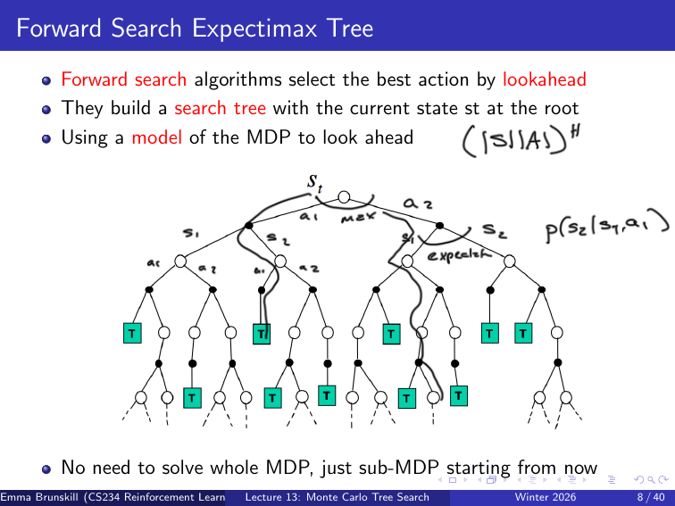
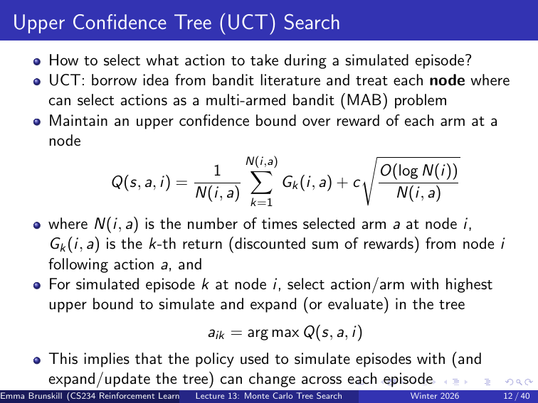
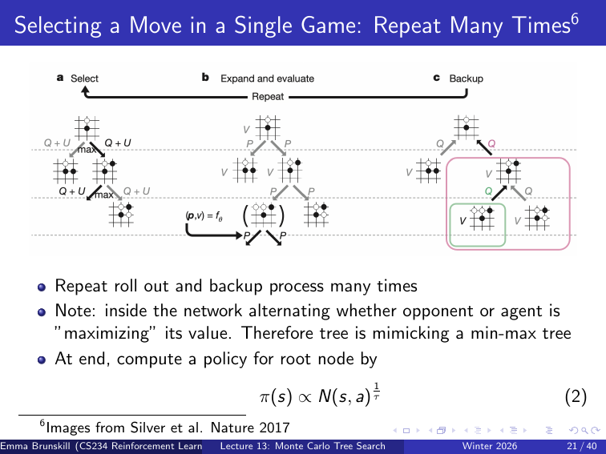
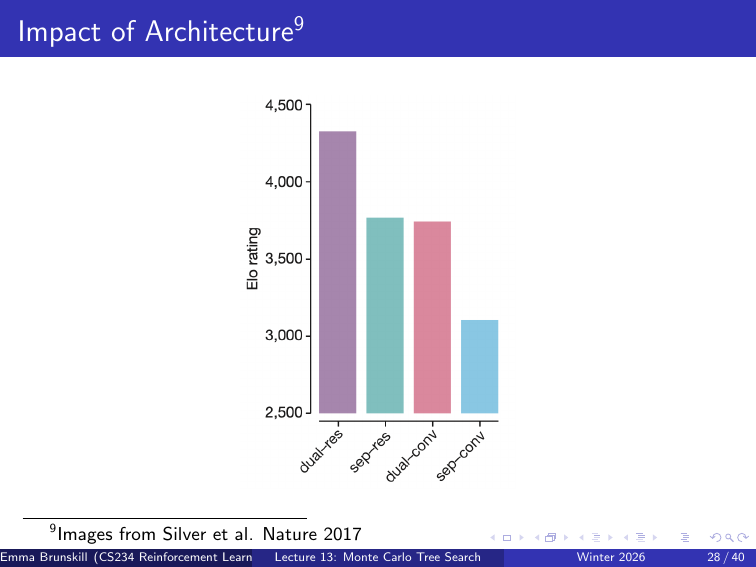
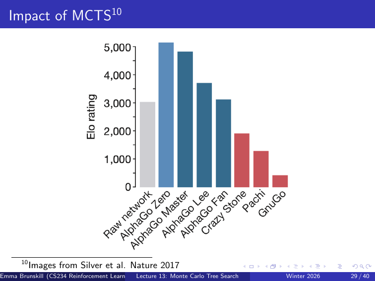
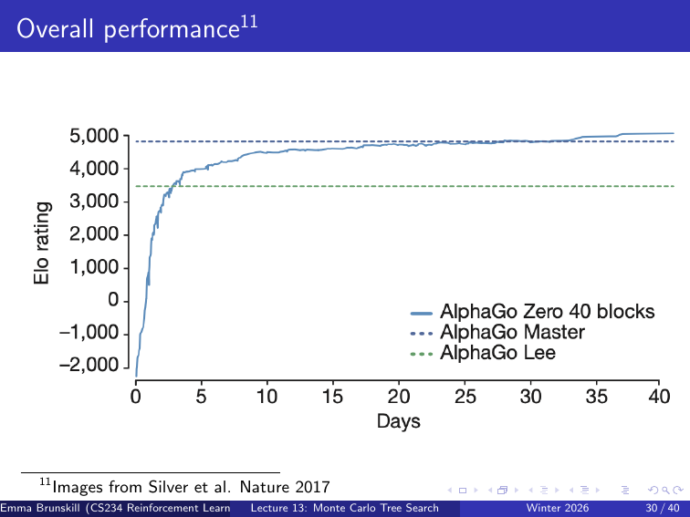

# CS234 Lecture 13 Notes: Monte Carlo Tree Search

来源：`lecture/lecture13post.pdf` 与 `lecture/lecture13pre.pdf`，CS234 Winter 2026，Emma Brunskill；post deck 有 13 个物理 PDF 页面，课件页脚为 1--40 的前半段；pre deck 有 40 个物理页面，包含 post deck 的重复内容以及 AlphaZero 的后半段。本笔记以 post deck 的 Simulation-Based Search 为主，并用 pre deck 的物理第 14--40 页补齐同一讲的 AlphaZero、理解检查和 UCT 复习。图示页码均指物理 PDF 页码。

笔记规范：`cs234-rl-tutor v2`。覆盖清单表示课件内容已经写入，不表示学习者已经掌握。

## 0. 本讲覆盖清单

- [x] post 物理第 1--2 页：标题、课程位置；写入 §1。
- [x] post 物理第 3--5 页：AlphaZero 动机、目录和“只为当前状态计算”；写入 §1 与 §2.1。
- [x] post 物理第 6 页：Simple Monte-Carlo Search；写入 §2.2。
- [x] post 物理第 7--9 页：expectimax 与 forward search 的局部计算、树规模限制；写入 §2.3。
- [x] post 物理第 10 页：MCTS 定义和搜索后动作选择；写入 §3.1。
- [x] post 物理第 11--12 页：UCT/MAB 视角、上置信界公式和动态 tree policy；写入 §3.2。
- [x] post 物理第 13 页：MCTS 优点；写入 §3.3。
- [x] pre 物理第 14--15 页：目录回顾、Go case study 和理解问题；写入 §4.1。
- [x] pre 物理第 16--21 页：AlphaZero 单局 move selection 的 start、expand、policy/value prediction、backup、重复搜索、root policy；写入 §4.2--§4.3。
- [x] pre 物理第 22--25 页：self-play、reward density/curriculum、policy/value network training；写入 §4.3--§4.4。
- [x] pre 物理第 26--27 页：AlphaGo/AlphaZero 要素、architecture/MCTS/human-data 评估问题；写入 §4.5。
- [x] pre 物理第 28--31 页：架构、MCTS、整体性能和 human-data 图；写入 §4.5。
- [x] pre 物理第 32 页：AlphaZero 向 chess、shogi、AlphaTensor、AlphaDev 的延伸；写入 §4.5。
- [x] pre 物理第 33--35 页：课程位置与 MCTS 理解检查及答案；写入 §5。
- [x] pre 物理第 36--40 页：UCT 深入理解检查及 Lecture 14 开场页；写入 §5；Lecture 14 的重复内容在 `lec14_notes.md` 回链本讲。

## 1. 本讲主线

与 Lecture 12 的关系：Lecture 12 讨论了 Fast RL，重点是如何通过模型估计、optimism、posterior sampling 或表示学习提高样本效率。本讲把“学习一个覆盖整个状态空间的策略”换成“在真正要行动的当前状态临时做局部搜索”，再用 Monte Carlo sampling 和 learned heuristic 控制搜索成本。

**本讲路线图**

1. 先从当前状态的局部决策出发，比较一步 policy improvement、完整 expectimax 和采样式搜索。
2. 用 MCTS 反复模拟、扩展和 backup，把计算集中到更有希望的分支。
3. 用 UCT 把每个树节点的动作选择写成一个 bandit-style 的探索/利用权衡。
4. 再看 AlphaZero：神经网络提供 action prior 和 leaf value，MCTS 把局部计算变成 root policy。
5. 最后通过 self-play、评估图和理解检查，区分课程明确结论、实验现象和适用边界。

课件后半段的课程结构页把下一项标为 Quiz；因此本讲的自测题是复习工具，不是已经收集到的 mastery 证据。

我现在真正处在状态 st​，其实不一定需要把整个状态空间全部算清楚。能不能就在 st​ 附近临时往未来搜索一下，然后决定这一步做什么？

## 2. 从全局规划到局部模拟搜索

本节承接 Lecture 2 的动态规划和 Lecture 3 的 Monte Carlo evaluation：前者能在模型上求值但可能需要遍历全空间，后者能用样本估计回报但通常只做一次策略评估。
现在的问题是：只为当前真实状态选择一个动作时，怎样把有限计算集中到最值得看的分支？

**本节路线图**

1. 明确“当前状态局部计算”与“预先求整个 state space policy”的区别。
2. 用 Simple Monte-Carlo Search 做一次动作层面的样本平均。
3. 用 expectimax 向前展开，理解完整树的准确性与指数规模。

->

1. **Lecture 2 的动态规划**
    - 知道模型后，可以精确往后推 value；
    - 但常常要遍历整个状态空间，太贵。
2. **Lecture 3 的 Monte Carlo evaluation**
    - 不精确穷举，而是用采样估计回报；
    - 但通常是在评估一个 policy，而不是专门为“当前一步”服务。
3. **这一节的新思路：local computation**
    - 不求整个 state space 的完整 policy；
    - 只从当前状态 st​ 出发，向前看若干步；
    - 只为当前动作选择服务。

### 2.1 只为当前状态做计算

如果下一步一定要在 $s_t$ 采取动作，就不必先为所有 $s\in\mathcal S$ 计算完整 policy。给定模型 $M_v$，可以从 $s_t$ 向前看若干步，只构造以 $s_t$ 为根的 sub-MDP；搜索结束后执行根动作，环境前进一步，再从新状态重新规划。

这是一种 **local computation**：额外算力只服务于当前决策。它与预先求解整个 MDP 的主要差异不是“是否使用模型”，而是计算预算和求解范围都局部化了。

### 2.2 Simple Monte-Carlo Search：一步 policy improvement

对于当前每个候选动作 a，先假设现在选它；然后用模型往后模拟很多次，看平均回报哪个大。

课件设定一个模型 $M_v$ 和用于模拟后续动作的 simulation policy $\pi$。本节采用如下有限时域约定：从当前时刻 $t$ 开始，$G_t$ 是一次模拟轨迹从 $R_{t+1}$ 开始的折扣回报；如果模拟还剩 $h$ 步，则

$$
G_t^{(h)}
=
\sum_{j=0}^{h-1}\gamma^j R_{t+j+1}.
$$

对每个候选当前动作 $a$，从真实状态 $s_t$ 固定执行 $a$，随后按 $\pi$ 和模型模拟 $K$ 条 episode，得到样本回报 $G_{t,k}^{(h)}(a)$。动作价值的 Monte Carlo 估计是

$$
\widehat Q_{K,h}^{\pi}(s_t,a)
=
\frac{1}{K}\sum_{k=1}^{K}G_{t,k}^{(h)}(a)
\;\longrightarrow\;
Q_h^{\pi}(s_t,a)
\quad (K\text{ 增大时的估计目标}).
$$
$Q_h^\pi(s_t,a)$
表示：
> **先在 st​ 执行动作 a，然后之后都按照 π 走，在 h-step horizon 下的真实期望回报**

这个平均值是有限样本估计量，不是一次具体轨迹的 realized return；箭头表示在合适条件下样本平均趋近于 simulation policy 的真实有限时域 action-value。最后只在真实环境执行

$$
a_t\in\arg\max_{a\in\mathcal A}\widehat Q_{K,h}^{\pi}(s_t,a).
$$

也就是说，后续仍按 $\pi$，当前动作却改为对估计价值贪心。这正是课件所说的 **一步 policy improvement**。

> [!example] 具体计算：用同一组模拟回报选根动作
> 设 $\gamma=1$、剩余时域为 2。对动作 $a_1$ 的三次模拟回报分别为 $2,0,1$，对 $a_2$ 的回报分别为 $1,1,1$。
>
> $$
> \widehat Q(a_1)=\frac{2+0+1}{3}=1,
> \qquad
> \widehat Q(a_2)=\frac{1+1+1}{3}=1.
> $$
>
> 两个动作打平；实际实现需要规定 tie-breaking（例如固定顺序或随机打破平局）。这个例子只说明样本平均可能不产生唯一动作，并不说明两个动作的真实价值相等。

普通 MC policy evaluation：
$V^\pi(s)=\mathbb E_{\tau\sim\pi}\left[\sum_{k=0}^{\infty}\gamma^k r_{t+k}\mid s_t=s\right]$

它关注$V^\pi(s)\quad\text{or}\quad Q^\pi(s,a)$，它是在建立一张**关于整个 policy 的价值地图**，V(s1),V(s2),V(s3)....

Simple MC Search：
我现在就在 st​，到底选哪个 a

我根本不关心把整个：

$Q^\pi(s,a)$ 全部学出来。

我只想知道： 在当前这个 st​ 下，a1​,a2​,a3​ 谁最好？

所以：对每个候选动作都模拟几次。

比如对于 a1​：

先强制
$s_t\xrightarrow{a_1}s_{t+1}$

然后从下一步开始按照某个 rollout policy π 往后跑。

比如跑 h=3 步：

$s_t\xrightarrow{a_1}s_{t+1}\xrightarrow{\pi}s_{t+2}\xrightarrow{\pi}s_{t+3}$

得到一次 return：

$G^{(1)}(s_t,a_1)$

重复 K 次：$G^{(1)},G^{(2)},\ldots,G^{(K)}$

再取平均

### 2.3 Forward-search expectimax：更深的局部求解

如果 $M_v$ 已知，可以把当前状态作为根，交替展开动作节点和模型产生的后继状态：动作节点取最大值，随机转移节点按 $P(s'\mid s,a)$ 做期望。这就是 **forward-search expectimax tree**。
它不求整个 MDP 的 policy，只求“从现在开始的局部 sub-MDP”中的根动作。

环境根据模型随机转移，所以做：

$\mathbb E_{s'\sim P(\cdot\mid s,a)}[\cdot]$

所以整个树是：

- 状态节点 → 选动作；
- 动作之后 → 环境随机转移到下一个状态；
- 再在新状态选动作；
- 再随机转移；
- 不断交替。

这里同时有两种运算：

决策者选动作时

取最大值：$\max$

环境随机转移时

取期望：$\mathbb E$

所以叫 **expecti-max**：

- expect：对随机后继 求期望；
- max：对动作选择取最大。

可以把它理解成：

$\boxed{V(s)=\max_a\left[R(s,a)+\gamma\mathbb E_{s'\sim P(\cdot|s,a)}V(s')\right]}$

而其中 expectation 展开就是：

$V(s)=\max_a\left[R(s,a)+\gamma\sum_{s'}P(s'|s,a)V(s')\right]$

做了动作a1，但可能到达不同的状态，所以是取期望：

$Q(s_t,a_1)=R(s_t,a_1)+\gamma\left[0.7V(s_1)+0.3V(s_2)\right]$

Expectimax 搜索树的计算，本质上就是在“当前状态附近临时做一小段有限深度的动态规划，也就是深度搜索”
算法可以理解为：

1. **Forward：展开**。从当前 s0​ 出发，把所有 action 展开；利用模型 P(s′∣s,a) 得到可能的 next state；然后继续展开 next state 的 action，一直到深度 h。
2. **Evaluate leaves：给叶子赋值**。比如搜到最底层后得到 V(s3​)=5, V(s4​)=10,…。
3. **Backup：从下往上计算**。遇到状态节点就对 action 取 max；遇到环境随机节点就按照 P(s′∣s,a) 做期望；一直算回根节点。
4. **最终只执行根节点的最佳动作**：
$$a_t^*=\arg\max_a Q_h(s_t,a)$$

之前出现

*图：来源 `lecture/lecture13post.pdf` 物理 PDF 第 8 页；原图中的 $s_t$ 是根，动作节点取 max，随机后继按模型概率展开。*

一步 policy improvement：只优化当前第一步，后面的动作全部交给固定策略 π

Expectimax 搜索树：不仅优化第一步，未来搜索到的每一个状态，也重新选择最好的动作。

有限时域 $H$ 下，最坏情况下树的规模随

$$
\mathcal O\left((|\mathcal S||\mathcal A|)^H\right)
$$

增长。
>如果 horizon 是 H，那么最坏情况下，搜索树规模会随着深度指数增长

这里的数量级是搜索树上可能的 state-action 分支数，不是说每个 MDP 的实际树一定达到这个上界；状态合并、确定性转移或剪枝都可能减少实际规模。

MCTS 的动机正是：不平均地展开整棵树，而是用采样把预算花在更有希望的局部。完整的搜索树会指数爆炸

## 3. MCTS：把模拟预算集中到有希望的分支

本节把上一节的“完整 forward tree”改造成可增量更新的搜索树。MCTS 仍从根状态出发，也仍依赖模型或模型采样器；新增的是选择规则、树统计量和反复 simulation 的组合。

**Expectimax：一次性把未来尽量全部展开。**  
**MCTS：一次只沿着树走一条路径，只新增一点点，然后把这一次得到的结果传回来；重复很多次后，树自己慢慢长出来**

**本节路线图**

1. 先给出 selection--expansion/evaluation--backup 的循环和输出。
2. 再说明 UCT 如何在每个节点平衡已知高价值分支与低访问分支。
3. 最后总结 MCTS 的 anytime、selective 和 black-box-model 特性。

### 3.1 MCTS 的数据流与一次完整迭代

给定模型 $M_v$，在当前真实状态 $s_t$ 建立根节点。每次 [simulation](academic-term-lookup:simulation) 从根开始，在树中选择动作、按模型采样后继状态；遇到尚未展开的节点就扩展或评估，并把本次回报沿路径 backup 到祖先。重复 $K$ 次后，读取根节点动作统计量，选择真实动作。

simulation 流程：

1. **Selection**：从根沿当前 tree policy 选择动作，直到到达未充分展开的边界。
2. **Expansion / evaluation**：到达边界后扩展一个或多个新节点；对叶节点得到回报估计。
3. **Simulation**：若没有直接 value estimate，就按 rollout policy 继续采样到终止或 horizon。
4. **Backup**：把沿路径得到的 return 更新到每条边的访问次数和价值统计量。
5. **Root action**：搜索停止后，按根的估计价值或 visit count 选当前真实动作。

数据流可以压缩为：

$$
\text{root}
\xrightarrow{\text{select}}
\text{leaf}
\xrightarrow{\text{expand/evaluate}}
G
\xrightarrow{\text{backup}}
(N,W,Q)\text{ on ancestors}.
$$

其中 $N$ 是访问次数，$W$ 是累计回报，$Q=W/N$ 是边或节点的样本均值；这些是 search estimate，不应与环境的真实 $Q^*$ 混为一谈。

Selection：从根往下选边

从根节点开始，按照当前的 **tree policy** 一路往下走，直到遇到：

- 一个还没充分展开的节点；
- 或者一个还没访问过的边；
- 或者到达终止状态。

这一步的核心问题是：

> **在树里的每个节点，我该选哪条动作边继续往下？**

这一点后面由 **UCT** 来解决。

在标准 MCTS 里，一个节点“fully expanded（充分展开）”通常只表示：

> **这个状态下所有可选动作，都已经至少被尝试过一次，并且对应的 action edge / child 已经加入搜索树**

只要当前节点已经 fully expanded，就用 UCT 选一条已经存在的边继续往下；一旦碰到一个还有动作没试过的节点，就停止 Selection

Expansion / Evaluation：扩展或评估：

当 selection 到达一个边界节点时，有两种做法：

做法 A：Expansion

把这个边界节点的一个或多个子节点加入树里。

做法 B：Evaluation

如果不再往下展开，可以直接给这个叶子一个 value estimate。

在经典 MCTS 里，常常是：

- 先扩一个新节点；
- 然后从它继续 rollout。

在 AlphaZero 那种方法里，更常见是：

- 扩展新节点；
- 直接用 value network 评估叶子值。

Simulation / Rollout：继续模拟
如果叶子节点还没有直接的 value estimate，就继续按一个 rollout policy 往后模拟，直到终止或到某个 horizon。

最终得到这次 simulation 的 return：$G$

**Expansion 是把后面的状态正式加入搜索树。**  
**Rollout 是临时往后模拟，用来估计这个新节点到底好不好，但通常不把这些状态加入搜索树。**

Backup：沿路径回传

然后把这次得到的 return G 沿着刚才走过的路径往回更新。

课件这里用了三个统计量：

访问次数：N

累计回报：W

平均值：$Q=\frac{W}{N}$

更具体一点，若在节点 i 选择动作 a，通常会维护：
​
$N(i,a),\qquad W(i,a),\qquad Q(i,a)=\frac{W(i,a)}{N(i,a)}$

这里：

- N(i,a)：从节点 i 走动作 a 这条边被选中过多少次；
- W(i,a)：这条边上累计得到的 return 总和；
- Q(i,a)：这条边目前的样本平均回报。

注意，这里的 Q(i,a) 是 **search estimate**，不是环境真实的最优 action-value。

Root action：最后怎么选真实动作？
常见有两种方式：

方法 1：按估计均值选

$a_t\in\arg\max_a Q(\text{root},a)$

方法 2：按访问次数选

$a_t\in\arg\max_a N(\text{root},a)$

很多现代方法（比如 AlphaZero）更偏向用 **visit count**

一次 MCTS iteration，只做一条路径！

对于搜索树里的每条 action edge，通常存：这条边的访问次数，累计return：以前经过这条边的所有 simulation，一共获得多少 return ， 平均价值

假设从根节点s0开始，后面都没有被探索过：

所以到s0，selection就结束了。 后面进行expansion：

按照某种规则，选择一个没试过，比如a1

调用 MDP model：$s_1\sim P(\cdot|s_0,a_1)$

进入状态s1 （但Expectimax 会把 a1​ 所有可能的 s′ 全部展开，mcts 会 sample 一个 s）

现在到了新节点：
​
$s_1$

但我们不想继续认真建树了。

随便找一个 rollout policy，比如随机策略：$\pi_{\text{rollout}}$

s1
 ↓
random action
 ↓
s2
 ↓
random action
 ↓
.....
 ↓
terminal

得到本次 simulation return：
$G=1+\gamma 2+\gamma^2 5$

这相当于：

> 我刚刚抽样了一种“如果选 a1​，未来可能发生什么”的情况。

再进行backup，把7传回来：

更新：

$N(s_0,a_1)\leftarrow N(s_0,a_1)+1$

$W(s_0,a_1)\leftarrow W(s_0,a_1)+7$

所以：
​
$Q(s_0,a_1)=\frac{W(s_0,a_1)}{N(s_0,a_1)}$

再第二次simulation：

重新s0开始，这次expansion a2动作...

现在s0的动作都访问过了，它是fully expanded，

那么 Selection 不再随便挑，而是算 UCT

UCT选择了一个动作，再次到达状态s1. 假设 s1​ 有三个动作：

b1​,b2​,b3​ ，一个都还没试

于是开始expansion

搜索树变成：
          s0
        /    \
       a1    a2
       |      |
      s1      s2
     /
    b1
    |
   s3   ← new

再从s3 rollout 得到 G=9

更新路径上**所有边**：

$N(s_1,b_1)\leftarrow N(s_1,b_1)+1$

同时：

$N(s_0,a_1)\leftarrow N(s_0,a_1)+1$

并更新它们的 return / Q。

进行不断的重复：最后可能形成

                  root
               /        \
              A          B
            / | \         \
           /  |  \         \
          ●   ●   ●         ●
         /        \
        ●          ●
       /
      ●
     /
    ●

为什么 A 那边特别深？

因为 MCTS 发现：

> A 看起来更有希望。

所以 UCT 会把更多 simulation budget 花在 A 上

假如搜索树最终样子：

                         s0
                  N=100, V=0.42
                   /           \
                a1               a2
              /                    \
            s1                      s2
        N=70,Q=0.55             N=30,Q=0.18
          /    \                   |
        a3      a4                 a5
        |        |                  |
       s3       s4                 s5
     N=50      N=20              N=30

> “站在 s0​，我已经花了 100 次模拟预算去思考未来；其中 a1​ 这个方向被考察了 70 次，而且平均结果不错；a2​ 被考察 30 次，结果较差。”

搜索树最终目的其实非常简单：

> **帮助当前状态 s0​ 选择一个动作。**

经典 MCTS 可以根据 Q 或访问次数决定；AlphaZero 中尤其常见的是根据访问次数：
$\pi(a\mid s_0)\propto N(s_0,a)^{1/\tau}$

> [!example] 具体计算：一次 MCTS simulation 如何改变根统计量
> 根节点有动作 $L,R$，初始 $(N,W)=(L:4,2.0;\ R:2,0.6)$。本次 selection 选择 $R$，模型采样到 $s'$，从叶节点得到本次折扣 return $G=1.4$。backup 只沿本次路径更新：
>
> $$
> N(R)\leftarrow 3,\qquad W(R)\leftarrow 0.6+1.4=2.0,
> \qquad Q(R)\leftarrow \frac{2.0}{3}\approx0.667.
> $$
>
> 根的总访问数也增加 1；下一次 selection 会用更新后的 $N$ 和 $Q$ 重新比较。这个过程展示了“采样一次，局部更新一次”，而不是每次 simulation 都重算整棵树。

### 3.2 UCT：用 bandit-style 上置信界选树内动作

MCTS 的关键问题是：模拟 episode 在树内该走哪条边？

课件的 UCT（Upper Confidence Tree）把每个可以选动作的树节点看作一个多臂 bandit 节点，并为每条边维护“平均回报 + 探索 bonus”。课件公式写作
$$
Q(s,a,i)
=
\frac{1}{N(i,a)}
\sum_{k=1}^{N(i,a)}G_k(i,a)
+c\sqrt{\frac{O(\log N(i))}{N(i,a)}}.
$$

整体上，第一项利用当前边的平均 return，第二项偏向访问次数较少的边；选择分数最高的动作继续 simulation 和 expansion。$N(i,a)$ 是节点 $i$ 选择动作 $a$ 的次数，$G_k(i,a)$ 是第 $k$ 次从该边出发得到的 discounted return，$N(i)$ 是节点访问总数，$c$ 控制探索强度，$O(\cdot)$ 表示课件没有展开的常数/数量级项。

为避免与真实 action-value 混淆，本文把这个带 bonus 的量称为 UCT score；若只写均值，则 $W(i,a)/N(i,a)$ 才是 search estimate。

首次访问的边没有可计算的均值。实际实现通常先强制每个未访问动作至少扩展一次，或把其 UCT score 设为 $+\infty$；这是实现约定，不是课件公式额外给出的定理。

*图：来源 `lecture/lecture13post.pdf` 物理 PDF 第 12 页；原图明确把节点动作选择类比为 MAB，并说明每次 simulation 的 tree policy 可以变化。*
i是第i次模拟，随着模拟次数的增加，上面的数据以及从数据推断出要选哪个动作 都是不固定的。 一次模拟就是一条路线

> [!example] 具体计算：bonus 让低访问动作获得机会
> 为便于展示，令 $c=1$ 且把课件的数量级常数取为 1。节点总访问数 $N(i)=16$；动作 $a_1$ 的均值为 $0.60$、$N(i,a_1)=8$，动作 $a_2$ 的均值为 $0.40$、$N(i,a_2)=2$。使用标准化的
>
> $$
> U(i,a)=\bar G(i,a)+\sqrt{\frac{\log N(i)}{N(i,a)}}
> $$
>
> 得到 $U(i,a_1)\approx0.60+0.589=1.189$，$U(i,a_2)\approx0.40+1.177=1.577$。虽然 $a_2$ 的当前均值较低，它仍会因信息不足而被优先探索。数值是说明用数据，非课件原例；课件本身用 $O(\log N(i))$ 保留了常数选择。

UCT 的“探索”发生在 **搜索计算层**：动作是在模拟 episode 中被选择的，目的是决定下一笔计算花在哪里，而不是直接向真实环境试错。因此 UCT 与 Lecture 9 的在线 bandit regret 优化不能直接画等号；Lecture 14 的理解检查会再次强调这一点。

### 3.3 MCTS 的优点与边界

课件列出以下优点：

- **Highly selective best-first search**：只扩展当前统计上更有希望的分支。
- **Dynamic evaluation**：随着新 simulation 到来，状态估计持续更新。
- **Sampling 缓解 curse of dimensionality**：不必枚举所有状态、动作和随机后继。
- **Black-box model 兼容**：只要模型能提供后继样本，就不一定需要显式写出完整转移表。
- **Anytime、可并行**：搜索随时可以停止并返回当前根动作，且不同 simulation 在工程上可以并行化（共享树时仍需处理并发更新）。

这些优点不等于“任意任务都适合 MCTS”。长 horizon、大 branching factor、低质量 value/rollout、昂贵模型调用或严重的状态表示问题都可能使有限 simulation 不足以找到好动作；课程理解检查把“短 horizon/小空间”和“长 horizon/大空间”的组合留给学习者判断，而不是宣称一个无条件的适用范围。

## 4. AlphaZero：学习启发式，再做局部战略计算

本节是 pre deck 对 post deck 的续接，也是从通用 MCTS 到 AlphaZero 的关键转折：树搜索不再只依赖固定 rollout policy，而是让神经网络提供 action prior 与 leaf value。Lecture 14 会重复这个流程并补充 PUCT 的课程定位，因此这里只保留第一次完整讲解。

**本节路线图**

1. 用 Go 说明为什么只求当前局面仍然需要强大的局部搜索。
2. 按 selection、expansion、network evaluation、backup 的顺序走完一轮。
3. 用 root visit counts 形成决策 policy，再通过 self-play 获得训练数据。
4. 讨论架构、MCTS 和 human data 的评估问题，以及向其他搜索问题的延伸。

MCTS 原来靠 rollout 自己慢慢搜；AlphaZero 让神经网络先告诉 MCTS“哪里可能值得搜、这个局面大概有多好”，然后 MCTS 再做局部精细计算。

### 4.1 Go case study：已知规则不等于容易规划

课件把 Go 描述为有约 2500 年历史的经典棋类和长期 AI 挑战；传统 game-tree search 在 Go 上难以直接成功。这里的理解问题是：下 Go 是否一定是在“dynamics 和 reward model 都 unknown 的世界”中学习？

更准确的回答是：在正式棋局中，规则、合法动作和胜负定义是已知的，因而它不是因为环境模型完全未知才成为 RL 问题；困难主要来自极大的搜索空间、长期战略后果和有效 heuristic 的学习。
AlphaZero 通过 self-play 学习 policy/value heuristic，再用局部 MCTS 计算当前落子。

AlphaZero 要学习的主要不是棋盘物理规则，而是两个非常关键的 heuristic：

policy heuristic 和 value heuristic

也就是：

> 哪些动作看起来值得搜？

以及：

> 这个局面看起来谁更有可能赢？

神经网络输出：

s 网络会同时输出两个东西： $(P_\theta(\cdot\mid s),v_\theta(s))$

$P_\theta(a\mid s)$
它表示：
> 神经网络认为在状态 s 下，动作 a 有多值得考虑

称他为 action prior

$v_\theta(s)$
表示：
> 神经网络预测，从状态 s 开始，对于当前玩家而言，这局最终结果大概有多好。

MCTS：
leaf
 ↓
rollout
 ↓
rollout
 ↓
rollout
 ↓
terminal
 ↓
G

AlphoZero：
leaf
 ↓
value network
 ↓
vθ(s)

>	不用每次都走到最后，我可以帮你估一下这里大概多少分。

$$\text{Selection}\to\text{Expansion}\to\text{Neural Network Evaluation}\to\text{Backup}$$

上一节学的是：

$$\text{Selection}\to\text{Expansion}\to\text{Simulation}\to\text{Backup}$$

假如到s2，发现这个节点没有被展开

于是把 s2​ 输入神经网络：
$s_2\longrightarrow f_\theta(s_2)$

得到：
$(P_\theta(\cdot\mid s_2),v_\theta(s_2))$

然后：
- Pθ​ 保存下来，用于将来决定从 s2​ 往哪搜；
- vθ​(s2​) 沿着刚才路径 backup。

比如：$W(s,a)=v_1+v_2+v_3=1.4$

$Q(s,a)=\frac{W(s,a)}{N(s,a)}=\frac{v_1+v_2+v_3}{3}$

之后的selection：

前面的普通 MCTS 用 UCT：
​
$Q(s,a)+c\sqrt{\frac{\log N(s)}{N(s,a)}}$

AlphaZero 风格里加入了 neural-network prior，常用 **PUCT**：
$$U(s,a)=c_{\mathrm{puct}}P_\theta(a\mid s)\frac{\sqrt{\sum_b N(s,b)}}{1+N(s,a)}$$
然后选择：

$$a=\arg\max_a\left[Q(s,a)+U(s,a)\right]$$

### 4.2 单局 move selection：从根到 backup

课件的动画来自 Silver et al. (Nature 2017)。一局棋的每一步都从当前根节点重新开始若干次 simulation；在真实棋盘上只执行最后选出的一个根动作。

**一次搜索的概览**

1. **Start at root**：把当前局面 $s$ 作为根。
2. **Select / repeatedly expand**：沿 tree policy 选择已有边，直到到达待扩展叶节点。
3. **Network policy prediction**：网络给出叶状态的动作先验 $P_\theta(a\mid s)$。
4. **Network value prediction**：网络给出从当前玩家视角的叶 value $v_\theta(s)$。
5. **Backup**：将 value 沿路径回传并更新访问次数、累计价值和均值；轮到对手时切换 max/min 视角。
6. 重复上述 simulation 多次，最后读取根节点的 visit-count policy。

在 AlphaZero 风格实现中，PUCT 常写成（课件只标注“使用 PUCT”，未在页内展开此公式）：

$$
U(s,a)
=
c_{\mathrm{puct}}P_\theta(a\mid s)
\frac{\sqrt{\sum_bN(s,b)}}{1+N(s,a)},
\qquad
a
\in
\arg\max_a\bigl(Q(s,a)+U(s,a)\bigr).
$$

整体含义是：$Q(s,a)$ 利用已经搜索到的结果，$P_\theta(a\mid s)$ 把网络认为有希望但尚未充分访问的动作推到前面，访问次数越少，分母越小，探索项越大。$c_{\mathrm{puct}}$ 是探索强度，$N(s,a)$ 是边访问次数；

$Q(s,a)=\text{MCTS 已经搜出来的结果}$

$P_\theta(a\mid s)=\text{network 事先给的 prior}$

$Q$、$N$ 是树统计量，$P_\theta$ 和 $v_\theta$ 是网络输出。这个写法是 AlphaZero 论文的标准补充，不应误读为 post deck 已经给出的 UCT 公式。

*图：来源 `lecture/lecture13pre.pdf` 物理 PDF 第 21 页（课件内部页脚 6/40），原图展示 repeat loop 以及在对手节点交替 value 视角。*

**一轮数据流**：根状态和当前树统计量 $\to$ PUCT selection $\to$ 叶状态 $\to$ $(P_\theta,v_\theta)$ $\to$ 沿路径 backup $\to$ 更新根的 $N,W,Q$。

> [!example] 具体计算：网络先验如何影响一次 selection
> 假设根有 $a_1,a_2$，当前 $Q(a_1)=0.50$、$Q(a_2)=0.45$，根总访问数为 10；网络先验为 $P(a_1)=0.20$、$P(a_2)=0.60$，且 $N(a_1)=8,N(a_2)=2$。为突出相对关系，取 $c_{\mathrm{puct}}=1$：
>
> $$
> U(a_1)=0.20\frac{\sqrt{10}}{9}\approx0.070,
> \qquad
> U(a_2)=0.60\frac{\sqrt{10}}{3}\approx0.632.
> $$
>
> 所以两者的 selection score 约为 $0.57$ 和 $1.08$，本轮会选择 $a_2$。这不是说 $a_2$ 的真实价值已经更高，而是网络先验与低访问次数共同提高了它获得后续计算的机会；真实 AlphaZero 还会使用具体的 value backup、噪声和超参数。

### 4.3 根 policy、self-play 与 reward density

重复 search 后，课件用根节点访问次数构造 policy：

$$
\pi_\tau(a\mid s)
=
\frac{N(s,a)^{1/\tau}}
{\sum_{b\in\mathcal A}N(s,b)^{1/\tau}}.
$$
> **network 的 Pθ​ 是搜索前的 policy；MCTS visit count 得到的 π 是搜索后的、更强的 policy。**

整体上，访问更多的动作概率更大；温度 $\tau>0$ 控制分布尖锐程度。$\tau\to0$ 时接近只选访问最多的动作，较大的 $\tau$ 保留更多随机性。课件只给出比例形式 $\pi(s)\propto N(s,a)^{1/\tau}$，上式补上了归一化常数。

τ 是 temperature。

如果：τ→0

那么 policy 越来越接近：

> 只选 visit count 最大的动作。

也就是越来越 greedy。

如果 τ 较大，则分布更平滑，保留更多随机性。

> [!example] 具体计算：visit count 到根 policy
> 若根动作访问数为 $N(s,a_1)=100$、$N(s,a_2)=25$，取 $\tau=1$，则
>
> $$
> \pi_1(a_1\mid s)=\frac{100}{125}=0.8,
> \qquad
> \pi_1(a_2\mid s)=\frac{25}{125}=0.2.
> $$
>
> 同一计数在更小 $\tau$ 下会更接近贪心，在更大 $\tau$ 下会更平滑；具体 temperature schedule 是实现选择，不是本页给出的固定定理。

Self-play 过程是：按根 policy 采样动作，执行一步，再以新局面为根重新搜索；持续到终局并记录胜负。对手和己方交替行动，所以 backup 时必须把 value 转换到相应玩家视角，不能把所有节点都当成同一个 max 玩家。

一个 move 内
做很多次 MCTS simulation。

一整个 game 内
每走一步，都重新以当前棋盘为 root 做 MCTS

课件强调 self-play 的三个好处：

- 不需要人工对手，主要瓶颈变成计算资源；
- 对手由当前系统产生，通常能提供匹配当前水平的挑战；
- 双方实力接近时，训练信号比只与极强或极弱对手对弈更密集，形成一种 curriculum learning。

“更 dense”是课件对训练信号的教学性概括，不表示每个时间步都有非零环境 reward；围棋仍通常在终局给出胜负结果，dense 指相对于固定不匹配对手而言，学习过程中可获得更有区分度的反馈。

### 4.4 训练 policy/value network

每个 self-play 局面可以留下三类信息：局面 $s$、搜索得到的根 visit-count policy $\pi_\tau(\cdot\mid s)$、最终从当前玩家视角得到的胜负结果 $z$。 一个训练样本就是：$(s_t,\pi_t,z)$

网络训练的目标是让 policy head 逼近搜索 policy，让 value head 预测最终结果；网络随后又作为下一批 MCTS simulation 的 heuristic。
神经网络输出的是：$(P_\theta(\cdot\mid s),v_\theta(s))$

policy head 模仿 MCTS
$P_\theta(\cdot\mid s)\approx\pi_{\text{MCTS}}(\cdot\mid s)$

value head 预测最终比赛结果
$v_\theta(s)\approx z$

这一闭环的顺序很重要：
$$
\text{network}
\rightarrow
\text{MCTS search}
\rightarrow
\text{self-play data}
\rightarrow
\text{network update}
\rightarrow
\text{better heuristic}.
$$

神经网络指导 MCTS，那神经网络是谁训练的？

>	MCTS 反过来训练神经网络

Network → MCTS
network 给：Pθ​,vθ​
帮助 MCTS 更高效地搜索。

MCTS → Network
MCTS 得到更好的：π​
作为 network policy head 的训练目标

最终真实胜负：z
作为 value head 的训练目标。

也就是说：
                  神经网络
              Pθ(a|s), vθ(s)
                    ↓
              指导 MCTS 搜索
                    ↓
             得到更强的 πMCTS
                    ↓
                self-play
                    ↓
              得到最终胜负 z
                    ↓
          训练样本 (s, πMCTS, z)
                    ↓
              更新神经网络
                    ↓
              更好的 Pθ, vθ
                    ↓
                   ...

==可以把 Network 和 MCTS 的角色理解成“快思考”和“慢思考”==

比如说下了一把棋：
s0
 ↓ MCTS
a0
 ↓
s1
 ↓ MCTS
a1
 ↓
s2
 ↓
...
 ↓
terminal

每一步，都有一个经过 MCTS 后得到的策略。
每一步它都会保存：$(s_t,\pi_t)$这个训练数据

最后最终赢了z = 1，输了z = -1，补充在后面

所以一局棋产生：

$(s_0,\pi_0,z),(s_1,\pi_1,z),(s_2,\pi_2,z),...$ 这些训练样本。

最开始：$f_\theta(s)\rightarrow(P_\theta,v_\theta)$

一把结束：利用数据，使得$P_\theta\rightarrow\pi_{\text{MCTS}}$，$v_\theta\rightarrow z$

课件页只要求“训练神经网络预测 policies 和 values”，没有给出完整损失或优化器；因此这里不把具体 loss、网络层数或训练 schedule 归为本讲已证明的课程结论。

### 4.5 AlphaGo/AlphaZero 的要素、评估和延伸

课件总结了六个互相配合的要素：

- **Self-play**：从规则和终局结果产生持续数据；
- **Strategic computation**：把额外算力用于当前局面；
- **Highly selective best-first search**：只扩展部分分支；
- **Power of averaging**：多次 simulation 的统计聚合降低单次 rollout 噪声；
- **Local computation**：不必在行动前完整求解全部状态；
- **Learn and update heuristics**：网络不断更新 policy prior 与 value 估计。

课件提出三个评估问题：架构本身的影响是什么？在 learned policy/value 上再加 MCTS 带来多少增益？与 human play 或使用 human data 相比如何？这些是实验设计问题，不能只凭一张结果图回答所有因果问题。

*图：来源 `lecture/lecture13pre.pdf` 物理 PDF 第 28 页（课件内部页脚 9/40），原图比较 dual-res、sep-res、dual-conv、sep-conv；只能读出相对高低，不能据此推断所有架构任务上的普遍排名。*

*图：来源 `lecture/lecture13pre.pdf` 物理 PDF 第 29 页（课件内部页脚 10/40），原图的 raw network 约 3,000，加入 MCTS 的 AlphaGo Zero 约 5,200；其余系统是课程用来比较的实验点。*

*图：来源 `lecture/lecture13pre.pdf` 物理 PDF 第 30 页（课件内部页脚 11/40），原图横轴为训练天数、纵轴为 Elo rating，并标出 AlphaGo Master 与 AlphaGo Lee 的参考线。*

从这些图可以作出有限的课程内观察：架构选择有影响；MCTS 在 learned network 之上带来显著搜索增益；self-play 系统的曲线随训练推进超过图中的人类/程序参考线。但图表没有单独证明“搜索一定比学习重要”或“无需人类数据对所有任务都成立”；这些需要控制变量和更广泛实验。

课件最后把 insight 推向 chess、shogi，以及 AlphaTensor（发现更快的矩阵乘法）和 AlphaDev（发现更快的排序算法）：若把“找到更快程序/算法”表示成巨大但可搜索的序列决策问题，RL 的搜索与评估机制也可能用于这类优化。这里是课程给出的概念性延伸，不等于本讲推导了这些系统的具体算法细节。

## 5. 课件理解检查与边界

与前面的 MCTS 和 AlphaZero 主线的关系：这些页面不引入新的搜索组件，而是检验学习者能否根据 horizon、branching factor、模型成本和玩家视角判断方法边界。

**本节路线图**

1. 先判断 MCTS 在不同 horizon/空间规模下的适用性。
2. 再区分 UCT 的计算分配与真实环境探索。
3. 最后把这个边界带到 Lecture 14 的 UCT 复习。

pre deck 末尾先问：MCTS 是否更适合短 horizon、小状态/动作空间，还是长 horizon、大状态空间、小动作空间？合理答案取决于树的 branching factor、horizon、模型调用成本和 value estimate 质量；MCTS 的 sampling 能缓解枚举，但不会消除长 horizon 和大动作空间的困难。

课件还提出 UCT 的一个“略显奇怪”的地方：UCB 原本用于在线 bandit 的探索/利用，而树内 selection 是为了选择下一次 **计算**，不是直接在真实环境中收集 reward。因而可以借用上置信界作为 metalevel reasoning 的启发式，但不能不加区分地声称“UCT 正在最小化真实 rollout regret”。Lecture 14 会继续用这个问题检查边界。

## 6. Assignment Readiness

- **已覆盖的前置知识**：MDP model、finite-horizon return、Monte Carlo evaluation、action-value、policy improvement、optimistic exploration 和 bandit UCB 的基本形式。
- **本讲新增能力**：能够解释 expectimax 与 MCTS 的规模差异，写出 UCT 的统计量，走完一次 selection/expansion/backup，并说明 AlphaZero 如何把 network prior/value 接入搜索。
- **尚未完成的实践**：没有运行 MCTS/AlphaZero starter code，也没有独立实现树节点统计、并发访问、Go 环境或网络训练。
- **掌握证据**：目前没有独立推导、代码实验或口头讲解记录；覆盖完成不等于 mastery。
- **下一步**：可以开始手写一个小型确定性树的 MCTS trace，再核对 UCT/PUCT 的 tie-breaking、未访问边处理和 terminal value 视角。

## 7. 本讲必会公式

1. **有限时域模拟回报**（先固定 reward timing：$R_{t+1}$ 是从 $s_t$ 执行动作后的第一笔 reward）：

   $$
   G_t^{(h)}=\sum_{j=0}^{h-1}\gamma^jR_{t+j+1}.
   $$

   它是单条 simulation 的 sample return；$\widehat Q$ 是样本平均，$Q_h^\pi$ 是对应 simulation policy 的期望。

2. **Simple MC search 的动作估计与选择**：

   $$
   \widehat Q_{K,h}^{\pi}(s_t,a)=\frac1K\sum_{k=1}^{K}G_{t,k}^{(h)}(a),
   \qquad
   a_t\in\arg\max_a\widehat Q_{K,h}^{\pi}(s_t,a).
   $$

   先平均 K 条固定首动作的模拟回报，再只改进当前真实动作。

3. **UCT score**：

   $$
   \bar G(i,a)+c\sqrt{\frac{O(\log N(i))}{N(i,a)}}.
   $$

   它是树内 selection score，不是真实环境中的最终 $Q^*$；第一项利用已收集回报，第二项给低访问边探索机会。

4. **根节点 visit-count policy**：

   $$
   \pi_\tau(a\mid s)=\frac{N(s,a)^{1/\tau}}{\sum_bN(s,b)^{1/\tau}}.
   $$

   它把搜索统计量转换为可用于 self-play 的动作分布；温度决定随机性。

5. **AlphaZero 风格 PUCT 补充**：

   $$
   a\in\arg\max_a\left[Q(s,a)+c_{\mathrm{puct}}P_\theta(a\mid s)\frac{\sqrt{\sum_bN(s,b)}}{1+N(s,a)}\right].
   $$

   课件只给出 PUCT 名称；该显示式是对标准 AlphaZero 搜索的补充，用于看清 network prior 如何进入树内 selection。

## 8. 容易混淆点

- **Simple MC search 与 MCTS**：前者对每个根动作独立模拟并平均，实质上一层 policy improvement；后者共享并增量更新树，把搜索预算选择性地分配给分支。
- **UCT score 与 $Q^*$**：UCT score 含 exploration bonus，是搜索过程中的临时排序量；它不等于真实最优 action-value。
- **搜索层探索与环境层探索**：UCT 的探索主要决定下一次 simulation 算哪里，不等于在线 bandit 中为了获得真实 reward 而试动作。
- **模型已知与 policy 已知**：expectimax/MCTS 需要模型或采样器，但仍可用搜索替代预先求出整个 policy；AlphaZero 还学习 policy prior/value heuristic。
- **visit count 与 probability**：$N(s,a)$ 是整数统计量，只有经过温度变换并归一化后才是根 policy 概率。
- **对手视角**：双人零和棋类 backup 时要交替视角；不能把对手节点也当作同一方的 max 节点。
- **source deck 差异**：Lec13 post deck 只到 MCTS 优点；AlphaZero 的完整内容来自 pre deck 后半段，不能把 post 的 13 个物理页面误报成完整 40 页。

## 9. 自测题

1. Simple MC search 中，为什么每个根动作的第一步要固定，而后续可以按 simulation policy？
2. 若某节点一个动作均值较高但访问次数很多，另一个动作均值较低但只访问一次，UCT 的两项分别会怎样影响选择？
3. MCTS 的一次 simulation 更新了哪些统计量？为什么不需要重算未经过的分支？
4. PUCT 相比 UCT 多利用了网络的哪一种输出？它仍然保留了什么搜索统计量？
5. 当 $N(s,a_1)=100,N(s,a_2)=25$ 且 $\tau=1$ 时，根 policy 为何是 $0.8/0.2$？温度减小时会发生什么？
6. “Go 规则已知”与“AlphaZero 使用 RL”为什么不矛盾？
7. 为什么不能从整体性能曲线直接断言 architecture、MCTS、self-play 三者各自的因果贡献？

查看答案

1. 固定第一步后，样本回报才对应“在当前真实状态执行候选动作 $a$”的 action-value；后续 policy 只是估计该动作之后的 continuation value。
2. 高均值增加利用项，低访问次数增加 bonus；UCT 可能先选低均值但高不确定性的动作。
3. 沿 selection path 的 $N,W,Q$（或等价统计量）被更新；未经过的分支没有新数据，因此不应被修改。
4. PUCT 使用网络给出的 action prior $P_\theta(a\mid s)$，同时保留访问次数和 value estimate，通过 bonus 影响下一次计算。
5. 归一化后 $100/(100+25)=0.8$、$25/(100+25)=0.2$；减小 $\tau$ 会放大计数差异，使分布更接近贪心。
6. RL 不要求规则一定未知；self-play 仍通过试错轨迹学习 heuristic，并用搜索在已知规则下优化当前决策。
7. 图表通常同时改变或组合多个组件；需要 architecture/MCTS/human-data 的控制变量和消融，单条曲线只能提供有限的比较证据。

## 10. 本讲小结

MCTS 把“从当前状态做局部决策”变成一个可增量更新的 simulation loop：树内 selection 选择下一笔计算，expansion/evaluation 获得新信息，backup 把 return 传回根。UCT 用 bandit-style upper confidence score 在利用已有回报和探索低访问边之间平衡。AlphaZero 再让网络提供 action prior 和 leaf value，通过 PUCT、root visit counts 和 self-play 形成“搜索改进 policy、policy/value 反过来改进搜索 heuristic”的闭环。整个方法的力量来自局部计算和统计聚合，但适用性仍受 horizon、branching factor、模型成本、value 误差和双人视角处理限制。

## 11. 延伸阅读

### 经典基础

- Browne et al., [A Survey of Monte Carlo Tree Search Methods](https://doi.org/10.1109/TCIAIG.2012.2186810), 2012：MCTS 四阶段循环与 UCT 背景。
- Kocsis and Szepesvári, [Bandit Based Monte-Carlo Planning](https://www.cs.utexas.edu/~shivaram/readings/b2hd-KocsisSzepesvari2006.html), 2006：UCT 的经典来源。
- Silver et al., [Mastering the game of Go without human knowledge](https://doi.org/10.1038/nature24270), Nature 2017：课件 AlphaGo Zero 图表和 self-play 设定的来源。
- Silver et al., [A general reinforcement learning algorithm that masters chess, shogi, and Go through self-play](https://doi.org/10.1126/science.aar6404), Science 2018：AlphaZero 的跨棋类扩展。

### 前沿动态

截至 2026-08-17 核实：本讲课件已经把 AlphaTensor、AlphaDev 作为“把加速问题表示为大规模搜索”的课程延伸；本笔记不额外添加未经本地课件要求的最新系统排名或“state of the art”结论。
